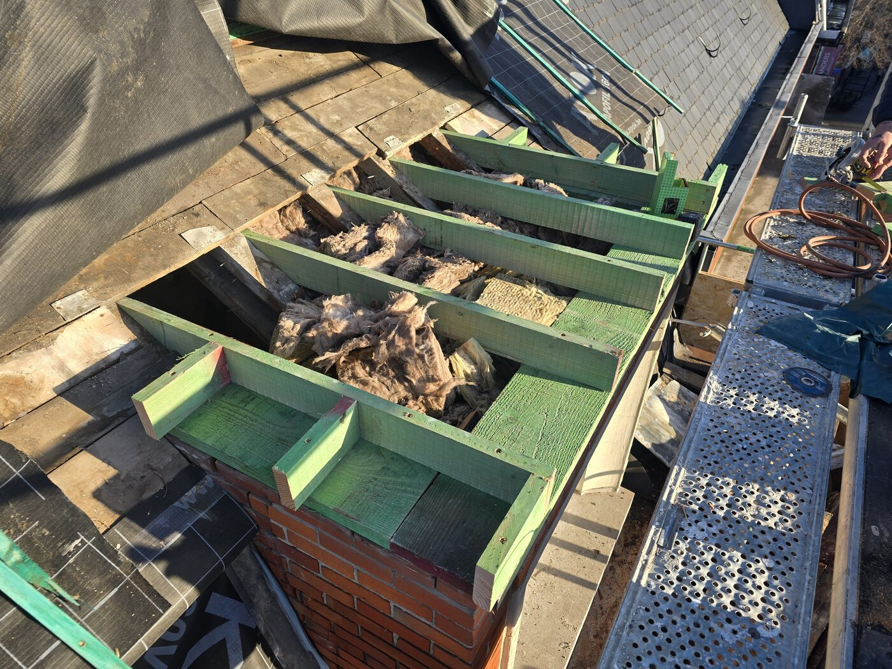
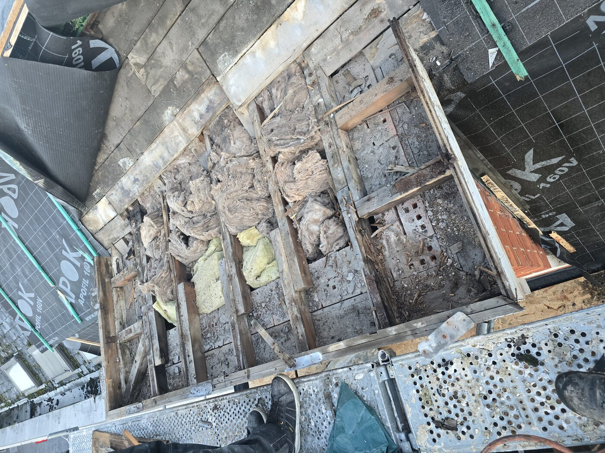
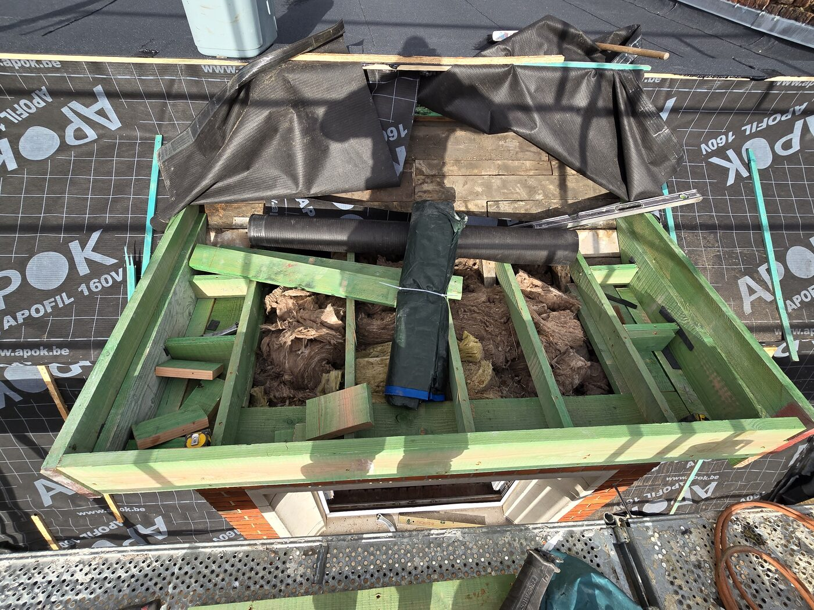
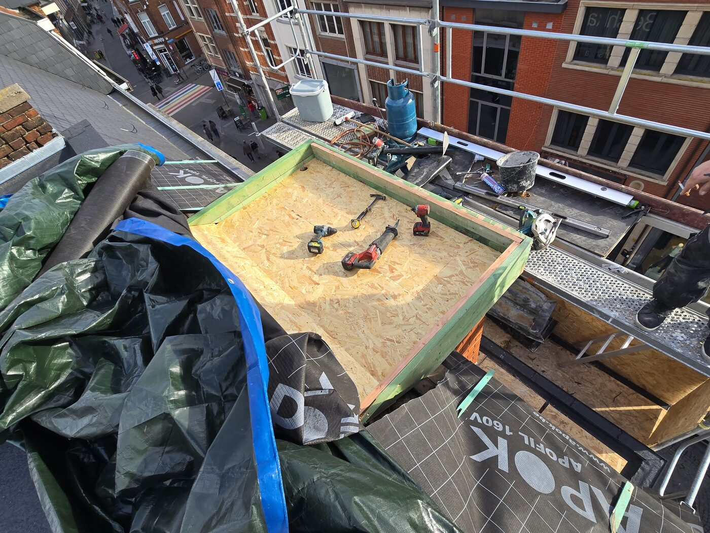

# LEKCJA 1.1 — KONSTRUKCJE DACHÓW PŁASKICH

## CZĘŚĆ 1: KONSTRUKCJA DREWNIANA (Houten dakconstructie)

---

## 🤔 Moment — kurs jest o papie bitumicznej. Po co nam konstrukcja?

Słuszne pytanie! Wielu młodych dakwerker'ów myśli: *"Mam zgrzewać papę, po co mi wiedza o belkach drewnianych czy stali?"*

**Odpowiedź:** bo konstrukcja to **fundament wszystkich Twoich decyzji** na dachu. **Bez znajomości podłoża nie zrobisz dobrej roboty z papą.**

### 🎯 Konkretnie — co zależy od konstrukcji?

**1. 🔥 Czy w ogóle możesz zgrzewać (branden)?**
- Drewno + OSB → **NIE zgrzewasz bezpośrednio** (pożar!) — najpierw dampscherm, potem mechaniczne mocowanie lub klejenie
- Beton → możesz zgrzewać do gruntowania
- Staaldek → **NIGDY nie zgrzewasz bezpośrednio** (deformacja, pożar)

**2. 🔧 Jaką techniką mocujesz papę?**
- Drewno → **klejenie** (lijmen) lub **mechaniczne mocowanie** (mechanisch bevestigen)
- Beton → klejenie, mechaniczne mocowanie, rzadziej zgrzewanie
- Staaldek → **prawie zawsze mechaniczne mocowanie** przez izolację

**3. 🌿 Czy możesz zrobić zielony dach (groendak)?**
- Drewno standardowe → tylko **sedum extensief** (~120 kg/m²)
- Drewno klejone → też intensief po obliczeniach
- Beton / staaldek → **wszystko możliwe**, też dachy parkingowe

**4. 🧱 Jaką papę dobierasz?**
- Konstrukcja drewniana → papa lekka, elastyczna (SBS), z mniejszym obciążeniem cieplnym
- Beton → możesz cięższe systemy, więcej warstw, papa APP
- Staaldek z PIR → systemy klejone na zimno lub mechaniczne

**5. 📦 Gdzie i jak składować materiały na dachu?**
- Drewno OSB → palety **na belkach nośnych** (nigdy w środku przęsła!)
- Beton → wszędzie OK
- **Staaldek → NIGDY nie stawiaj całej palety papy w jednym miejscu!** Ciężar punktowy 800-1200 kg na 1 m² wgnie blachę. Rozdzielaj palety, kładź na **belkach nośnych (gordingen)**, a najlepiej **rozkładaj rolki pojedynczo**

**6. 💧 Jak rozkłada się wilgoć w dachu?**
- Konstrukcja drewniana = ryzyko kondensacji wewnętrznej → **dampscherm jest krytyczny**
- Beton = duża pojemność cieplna → mniej kondensacji
- Staaldek = przewodzi zimno → mostki termiczne na każdym gordingu

**7. ⚖️ Ile masz "zapasu" obciążenia?**
- Stary dach drewniany z lat 70 → może ledwo wytrzymuje sam siebie + papę → **NIE dokładaj nowych warstw bez liczenia!**
- Beton → zwykle masz duży zapas
- Staaldek → liczone "do milimetra" — każdy dodatkowy kg się liczy

---

> 🔑 **Tip Mariusza:** widziałem na własne oczy jak młody dakwerker postawił **paletę papy z dźwigu na środku staaldeku**. Blacha się **wygięła w łuk**, zanim zdążyłem krzyknąć. Strata: 2 dni opóźnienia + wymiana 4 płyt staaldeku + reklamacja. **Wystarczyło wiedzieć że staaldek to nie beton.**

**Dlatego ZAWSZE** zanim wejdziesz na dach żeby zrobić papę — **zorientuj się NA CZYM STOISZ**. Ta lekcja Ci to wytłumaczy.

---

### 🎯 Po tej lekcji będziesz wiedział:
- Z czego składa się drewniana konstrukcja dachu płaskiego
- Jaka jest różnica między drewnem litym a klejonym (gelamelleerd / LVL)
- Jakie przekroje belek się stosuje w Belgii (REALNE wymiary z budowy!)
- Co decyduje o trwałości — i co ją zabija
- **Dlaczego konstrukcja MUSI być w poziomie**, a spadki robimy osobno
- **Dlaczego wokół PIR daje się pas wełny mineralnej** (nowa zasada Buildwise)
- Jak rozpoznać dobrą konstrukcję od złej już na placu
- **Jak Twoje decyzje przy układaniu papy zależą od konstrukcji** pod nią

---

## 1. CO TO JEST I KIEDY JĄ STOSUJEMY

**Konstrukcja drewniana** to najczęstsze rozwiązanie w Belgii dla:
- domów jednorodzinnych (woningbouw)
- rozbudów, dobudówek (aanbouw, uitbouw)
- garaży, carportów, składów
- nadbudów na istniejących budynkach (tam gdzie strop nie udźwignie betonu)
- **dachów zielonych ekstensywnych** (sedum) — drewno daje radę przy poprawnym projekcie

**Dlaczego drewno?**
- ✅ **Lekkie** — mniejsze obciążenie ścian i fundamentów
- ✅ **Szybki montaż** — 1-2 dni na średni dach jednorodziny
- ✅ **Łatwe przeróbki** — wycięcie otworu pod świetlik = piła + dłuto
- ✅ **Tanie** w stosunku do betonu (oszczędność 30-50%)
- ✅ **Eko** — odnawialny materiał, niski ślad CO₂
- ✅ **Łatwe izolowanie** — przestrzeń między krokwiami = miejsce na MW/PIR

### ⚠️ Drewno ma swoje granice — wtedy kombinujemy:

| Sytuacja | Rozwiązanie |
|----------|-------------|
| Rozpiętość >7m | Drewno klejone **(gelamelleerd / GL24-GL32)** lub **LVL (Kerto)** |
| Rozpiętość >12m bez podpór | Stalowy IPE/HEA z drewnem wtórnym, lub w pełni stal |
| Dach zielony intensywny (ogród z drzewami) | Drewno klejone z konstruktorem albo beton |
| Taras intensywnie użytkowany (meble, ludzie) | Wzmocnione przekroje + konstruktor |
| Budynki przemysłowe z dużymi siłami dynamicznymi | Stal lub beton |
| Akustyka między mieszkaniami (apartamenty) | Beton — drewno przenosi dźwięk |

> 🔑 **Tip Mariusza:** widziałem osobiście **belki 320×100 mm na 9 m rozpiętości** — i to działa. Ale to było drewno klejone albo wysokoklasowe. Drewno tartakowe na tej rozpiętości się ugnie. **Klucz to KLASA + KONSTRUKTOR.**

---

## 2. DREWNO LITE vs KLEJONE — RÓŻNICA TO NIE FANABERIA

### 🪵 Drewno lite (massief hout)
- Klasa: **C16, C18, C24, C30** (EN 338)
- Najczęściej **świerk** (vuren) lub **sosna** (grenen)
- **Ekonomicznie** sensowne do ~6-7 m rozpiętości
- Tańsze, dostępne wszędzie, łatwe w obróbce
- Wadą: **anizotropia** — sęki, skręty, nierówna jakość

### 🌲 Drewno klejone gelamelleerd (Glulam)
- Klasa: **GL24h, GL28h, GL32h** (EN 14080)
- Klejone z lameli (warstewek) drewna iglastego
- **Jednorodne** — przewidywalna nośność, brak słabych punktów
- Możliwe **wielkie przekroje** i **długości >20 m**
- Może być **gięte na łuk** — architektoniczne dachy
- Cena: **+30-50%** vs drewno lite, ale przy dużych rozpiętościach **TAŃSZE** (mniej belek)

### 🔥 LVL — Laminated Veneer Lumber (np. **Kerto Q, Kerto S**)
- Sklejka konstrukcyjna z bardzo cienkich warstw fornirów
- **Najwyższa wytrzymałość** ze wszystkich produktów drewnopochodnych
- Przekroje są **smuklejsze** niż gelamelleerd przy tej samej nośności
- Idealne na duże rozpiętości i wysokie obciążenia punktowe

> 💡 **Praktyka:** dla dachu jednorodziny do 6-7 m rozpiętości — **drewno lite C24 wystarczy**. Powyżej tego — **przejście na gelamelleerd**. Konstruktor i tak policzy, ale Ty już musisz wiedzieć co zamawiasz.

---

## 3. ELEMENTY KONSTRUKCJI DACHU — Z CZEGO TO SIĘ SKŁADA

> 📌 W tej lekcji skupiamy się na **konstrukcji samego dachu** — belki, krokwie, poszycie. Słupy, ściany nośne i fundamenty to inny temat (każdy projekt to osobne rozwiązanie).


*Nowa konstrukcja drewniana: zielone impregnowane belki (gordingen) na murze, stara wełna między nimi w trakcie wymiany. Renowacja dachu płaskiego.*

### 🔻 Belki nośne / podciągi (gordingen / hoofdbalken)
- Poziome, biegną w jednym kierunku
- To **główne elementy nośne** dachu — przenoszą obciążenia
- Im większa rozpiętość — tym **WYŻSZY** przekrój (nie szerszy!)
- Rozstaw między belkami **h.o.h. 2,5–4 m** zależnie od krokwi
- **MUSZĄ być położone w poziomie** (zob. punkt 6 — to KRYTYCZNE)

### 🔻 Krokwie / żebra (kepers / dakliggers)
- Drugorzędne belki na które kładzie się poszycie
- **Rozstaw h.o.h. 40–60 cm** — najczęściej **40 cm** (pasuje pod płyty OSB 122×244)
- W dachu płaskim **kładziemy je w poziomie** — spadek robimy osobno (klin, afschotisolatie)

### 🔻 Stężenia w dachu płaskim
W konstrukcji dachu płaskiego nie ma typowych "zastrzałów" pod krokwiami (bo nie ma kąta jak w dachu spadzistym). Ale stężenie i tak musi być:

**Pozioma tarcza usztywniająca (windverband):**
- Płyty OSB 18 mm pełnią rolę **tarczy** — usztywniają konstrukcję w płaszczyźnie poziomej
- Bez OSB konstrukcja "chodzi" przy wietrze
- To podstawowe stężenie dachu płaskiego

**Diagonalne stężenia w ścianach:**
- Ukośne elementy w **ścianach** budynku (lub między słupami przy carportach)
- Zapobiegają przewracaniu się całej konstrukcji przy wietrze bocznym
- Szczególnie ważne przy **carportach, garażach otwartych, wiatach**


*Rozbiórka: stare belki, zniszczona wełna mineralna, folia Apok Apofil 160V. Pokazuje co zastajesz w renowacji starego dachu drewnianego.*

### 🔻 Poszycie (beplating)
- **OSB-3 lub OSB-4** o grubości **18 mm** (standard), **22 mm** przy większych rozstawach
- Albo **multiplex (sklejka)** 18 mm — droższe ale stabilniejsze przy wilgoci
- **Mijanka (verspringend leggen):** poprzeczne łączenia płyt **MUSZĄ być przesunięte minimum 60 cm** między rzędami (idealnie połowa płyty = 122 cm, ale 60 cm = bezpieczne minimum)
- Płyty układane **prostopadle do krokwi** — dłuższy bok (244 cm) w poprzek
- Łączenia **dłuższego boku** zawsze na krokwi
- **Szczelina dylatacyjna 2–3 mm** między płytami (drewno pracuje!)
- **Mocowanie:** wkręty/gwoździe pierścieniowe **co 15 cm na krawędzi, co 30 cm w polu**


*Konstrukcja z bliska: zielone belki, kratownica usztywniająca, folia Apok dookoła, świetlik pod spodem.*


*Gotowa konstrukcja drewniana zamknięta poszyciem OSB, attyka z drewna. Podłoże gotowe pod dampscherm i izolację.*

> 🚨 **Mijanka mniejsza niż 60 cm** = łączenia OSB w jednej linii pionowej = **słaba strefa**: spróchnieje pierwsza, papa pęknie nad łączeniem, woda przejdzie. Norma niektórych producentów (Egger, Kronospan) daje 30 cm jako minimum, ale w praktyce **idziemy w 60 cm**.

---

## 4. REALNE PRZEKROJE BELEK STOSOWANE W BELGII

> 📌 **TO SĄ WYMIARY KTÓRE FAKTYCZNIE KUPISZ W HUTHANDLU** (Aerts, Mathy, Van der Sanden, itp.) i które zobaczysz na placach budowy w Belgii. Nazewnictwo belgijskie: **wysokość × szerokość** (h × b).

### 🔢 Standardowe przekroje belek i desek konstrukcyjnych (drewno lite C24):

| Wymiar (h × b) | Typowe zastosowanie |
|----------------|---------------------|
| **15 × 6,5 cm** (150×65) | Krokwie, dach standardowy do 3 m |
| **18 × 6,5 cm** (180×65) | Krokwie, dach do 3,5-4 m |
| **18 × 7,5 cm** (180×75) | Krokwie, dach z większym obciążeniem |
| **22,5 × 7,5 cm** (225×75) | Krokwie, dach do 4,5-5 m, sedum |
| **24,5 × 3,6 cm** (245×36) | **Deska konstrukcyjna** — gęsto z zastrzałami (krzyżakami), używana też przy dużych połaciach skośnych. Lekka, dobra nośność |
| **30 × 10 cm** (300×100) | Belki nośne, średnie rozpiętości |
| **42 × 12 cm** (420×120) | Belki nośne, duże rozpiętości |

> 🔑 **Tip Mariusza — deska 24,5×3,6:** ja sam zrobiłem dach garażu na takiej desce, **rozpiętość 4 m**. Deska sama w sobie jest dużo **lżejsza** niż klasyczna belka, a sporo udźwignie — pod warunkiem **częstych zastrzałów krzyżakowych** (kruisverband) między deskami. Im więcej zastrzałów, tym sztywniejsze jak beton. Stosuje się to też **na skosach przy dużych połaciach** (np. dach hali, garaż wielostanowiskowy). Buildwise nie ma wprost takiej rekomendacji w TV 280 — to bardziej praktyka rynkowa / rozwiązanie konstruktorskie. Konstruktor musi to policzyć indywidualnie.

> 🔑 **Notacja w Belgii:** zwykle pisze się **"15/6,5"** lub **"15x6,5"** = wysokość/szerokość w cm. Po polsku odwrotnie (b×h). **Uważaj zamawiając w hurtowni** — pomyłka oznacza inną belkę!

### 🔢 Drewno klejone (Gelamelleerd GL24h) — typowe wymiary:

| Wymiar (h × b) | Typowe zastosowanie |
|----------------|---------------------|
| 32 × 10 cm | Belka nośna 7-8 m |
| 40 × 10 cm | Belka nośna 9-10 m |
| 40 × 14 cm | Hala / duże rozpiętości 10-11 m |
| 50 × 16 cm | Hala 12+ m |
| 60 × 20 cm | Duże hale, supermarkety |

### 🧮 Reguła praktyczna (rule of thumb):

```
Wysokość belki [mm] = Rozpiętość [mm] ÷ 20
```

**Przykłady:**
- Rozpiętość 4 m → belka min. 200 mm wysokości
- Rozpiętość 5 m → belka min. 250 mm
- Rozpiętość 7 m → belka min. 350 mm (już raczej gelamelleerd)
- Rozpiętość 9 m → belka min. 450 mm (gelamelleerd)

> ⚠️ **Każdy projekt powyżej carportu MUSI policzyć inżynier-konstruktor wg Eurocode 5 (EN 1995).** Buildwise publikuje predimensioneringstabellen w artykule *Dimensionering van houten daktimmerwerk* (2011/04.06) — dostępne dla członków Buildwise po zalogowaniu.

---

## 5. OBCIĄŻENIA — CO MUSI UDŹWIGNĄĆ

### Stałe (eigen gewicht):
- Konstrukcja drewniana sama z siebie: **15–25 kg/m²**
- Poszycie OSB 18 mm: **11 kg/m²**
- Izolacja PIR 12 cm: **4 kg/m²**
- Papa 2 warstwy: **8–10 kg/m²**
- **Razem konstrukcja: ~40–50 kg/m²**

### Zmienne (veranderlijke belasting):
- **Śnieg** w Belgii (NBN EN 1991-1-3): **40–60 kg/m²** zależnie od regionu
- **Wiatr**: zmienne, do **80 kg/m²** ssanie na narożach (TO ZRYWA DACHY!)
- **Dach użytkowy** (taras): minimum **150 kg/m²**
- **Dach zielony ekstensywny** (sedum): **80–120 kg/m²** w stanie nasyconym → **drewno OK**
- **Dach zielony intensywny**: **300–600 kg/m²** → **drewno klejone + konstruktor lub beton**

### 🚨 NAJCZĘSTSZY BŁĄD:
Klient mówi *"a może później zrobimy tarasik"* — i konstrukcja zaprojektowana pod dach niedostępny **NIE UDŹWIGNIE**. Zawsze pytaj o przyszłe zamiary i licz z zapasem 20%.

---

## 6. ⚠️ KRYTYCZNE: KONSTRUKCJA W POZIOMIE — SPADKI OSOBNO!

> 🚨 **TO JEST NAJWAŻNIEJSZY PUNKT TEJ LEKCJI** 🚨

**Konstrukcja nośna dachu (belki nośne + krokwie) MUSI być położona w idealnym poziomie.** Spadek dachu robi się **osobno**, dopiero NAD konstrukcją.

### Dlaczego to jest tak ważne?

Jeśli położysz całą konstrukcję pod kątem (np. żeby od razu mieć spadek 2%):

1. **Belki nośne pchają w ściany boczne** — nieosiowe obciążenie generuje siły poziome
2. **Ściany dostają parcie boczne** — z czasem **PĘKNIĘCIA W MURZE**, zwłaszcza w narożach i nad oknami
3. **Krokwie zsuwają się z belek nośnych** — zwłaszcza przy niewłaściwym mocowaniu
4. **Cała konstrukcja "pływa"** w czasie — drewno pracuje, każde drewno się trochę odkształca, na nachylonej konstrukcji to się kumuluje
5. **Mocowania pracują w złych kierunkach** — wkręty/gwoździe nie są projektowane na siły osiowe wzdłuż osi
6. **Reklamacja gwarancyjna na 100%** — pęknięte ściany to zawsze winowajca: **dach wypchnął**

### Jak prawidłowo zrobić spadek dachu płaskiego:

✅ **Opcja 1: Klin spadkowy (afschotwig) z drewna**
- Trójkątne kliny z drewna przybijane na krokwie
- Dają spadek **na poszyciu OSB**, nie na konstrukcji

✅ **Opcja 2: Afschotisolatie (izolacja ze spadkiem)** — NAJNOWOCZEŚNIEJSZE
- Płyty PIR/PUR z fabrycznym spadkiem (np. Soprema Efisarking, Recticel Eurothane Silver, IKO Enertherm)
- Spadek 1,5% lub 2% wbudowany w grubość izolacji
- Szybkie, dokładne, gwarancja producenta

✅ **Opcja 3: Hellingslaag (warstwa spadkowa) z lekkiego betonu**
- Tylko przy konstrukcji betonowej — nie drewnianej!

❌ **NIGDY:** nie pochylaj samej konstrukcji żeby zrobić spadek!

### Spadek minimum (wg Buildwise):
- **TV 280** (aktualizacja 2022, zastąpiła TV 215): minimum **2%** spadku
- W praktyce projektuj **3%** — bo drewno się ugnie z czasem i z 2% zrobi się 1% → **woda stoi**
- Dachy z mniejszym spadkiem niż 2% nazywane są **"daken zonder helling"** — wymagają specjalnych membran

> 📚 **Aktualizacja 2022/2023:** Buildwise zastąpiło **TV 215 → TV 280** *Het platte dak* — to nowa "biblia" dla dakwerker'a, z nowym rozdziałem **"Pathologie"** (typowe szkody) i zaktualizowanym rozdziałem o renowacji.

---

## 7. ⚠️ NOWA ZASADA BUILDWISE: PIR + WEŁNA WOKÓŁ ATTYK

> 🆕 **To jest prawdziwy problem, potwierdzony badaniem Buildwise (artykuł 2022/02.04):**

### Problem:
Płyty **PU/PIR** używane jako izolacja dachu płaskiego pod wpływem wilgoci (kondensacja, deszcz w trakcie budowy, wilgoć z konstrukcji) **rozszerzają się** i **wypychają attyki na zewnątrz**. Buildwise zidentyfikowało **~50 udokumentowanych przypadków szkód**.

### Skutki:
- **Pęknięcia w gevelmetselwerk** (mur elewacji)
- **Rysy w ETICS** (system ocieplenia ściany)
- **Przesunięcie attyki** na zewnątrz, czasem nawet 5-10 mm
- **Zerwanie połączenia** dampscherm + dakdichting przy attykach

### Rozwiązanie (nowa zasada Buildwise od 2022):

**Przy izolacji PIR/PU MUSI być:**
1. **Pas wełny mineralnej (rotswol) ~5 cm szerokości wokół attyki** — wełna nie rozszerza się od wilgoci. Grubość pasa **dopasowana do grubości PIR** (jeśli PIR 12 cm — wełna też 12 cm)
2. **Mechaniczne kotwienie attyki do dakvloer** (nawet jeśli to attyka z cellenbeton/Ytong)
3. **Specjalna zaprawa** z dodatkiem przyczepności (hechtingsverbeteraar) pod pierwszym rzędem cellenbeton

**Przy izolacji z wełny mineralnej (rotswol) całego dachu** — kotwienie attyki **NIE jest obowiązkowe** (wełna nie rozszerza się).

### Dlaczego pas wełny po obwodzie?
1. **Brandweerstand** — wełna ma klasę A1 (niepalna), tworzy strefę przeciwpożarową przy attykach
2. **Nie rozszerza się** → nie wypycha muru
3. **Pochłania wilgoć** → buforuje przy ewentualnych przeciekach
4. **Spełnia nowe wymogi Buildwise** — bezpieczeństwo prawne dla wykonawcy

### 🎯 Rotswolhoeken (kątowniki z wełny) — sprytna technika z budowy

> 💡 **Tip Mariusza z praktyki:**
>
> **Pas wełny robię szerokości tylko 5 cm** — bo jak dasz więcej, **NIE ZGRZEJESZ NA WEŁNIE PAPY** (papa nie chwyta na rotswol jak na PIR).
>
> Na te 5 cm pasa kładę **rotswolhoeken (kątowniki rotswol) LUZEM** — i przykrywam je papą. Dzięki temu:
> 1. **Minimalizujemy mostek termiczny** w narożu attyka-dach
> 2. **Papa nie jest zgrzana pod 90°** — łuk ~3-5 cm radius (bardziej naturalny)
> 3. **Nawet jak budynek "pracuje" (osiada, dilatuje), papa nie odrywa** — bo rotswolhoeken pracują **luzno** i zostają na swoim miejscu
> 4. Cała konstrukcja rogu (attyka↔dak) ma elastyczną strefę przejściową
>
> **To nie jest oficjalna instrukcja Buildwise** — to praktyczna technika dakwerker'ów którzy znają temat. W TV 244 jest mowa że **opstand musi być pod kątem 45°, nie 90°** (bitumen pęka pod 90°), ale Buildwise nie podaje wprost tej techniki z luźnymi rotswolhoeken.

### 📏 Uwaga o grubości PIR i Rd-waarde

W Belgii dla **premii dakisolatie** (Mijn VerbouwPremie / Fluvius) wymagana jest **Rd ≥ 4,5 m²K/W** (renowacja). Niektóre gminy zaczęły wymagać już **Rd 5,45 m²K/W** dla pewności premii.

**HACZYK:** nie każdy PIR 12 cm spełnia tę wartość! Zależy od **lambda (λ)**:
- λ = 0,022 W/m·K → 12 cm daje Rd ≈ **5,45** ✅ (premium PIR — np. Recticel Eurothane Silver, IKO Enertherm ALU)
- λ = 0,025 W/m·K → 12 cm daje Rd ≈ **4,8** ✅ (większość pap PIR na rynku)
- λ = 0,028 W/m·K → 12 cm daje Rd ≈ **4,3** ❌ (gorsza klasa, **NIE spełnia premii**)

**Dlatego wiele gmin dla pewności wymaga już 14 cm PIR**, niezależnie od deklarowanej lambdy.

> 💡 **Tip Mariusza:** zamiast jednej warstwy 12 cm, **lepiej położyć 2 warstwy mijankowo** — np. **8+6 cm lub 6+8 cm**. Dlaczego?
>
> 1. **Eliminacja mostków termicznych** na łączeniach płyt (drugie warstwa zakrywa szczeliny pierwszej)
> 2. **Większa stabilność termiczna** dachu
> 3. **Mniej kondensacji** wewnątrz pakietu
> 4. **Lepsze ułożenie** wokół przejść (afvoer, doorvoeren)
> 5. Wyższa **rzeczywista** wartość Rd niż jedna gruba warstwa
>
> *Pełny temat izolacji omówimy w osobnej lekcji o systemach izolacyjnych.*

---

## 8. WYMAGANIA TECHNICZNE — CO MUSI BYĆ

### 🌲 Drewno:
- **Klasa wytrzymałości: minimum C24** dla litego, **GL24h** dla klejonego
- **Wilgotność: max 18%** przy montażu (mokre drewno wypaczy całą konstrukcję!)
- **Suszone komorowo (KD — kiln dried)**, nie z tartaku świeże
- Klasa **C30** używana gdzie potrzebna wyższa wytrzymałość — droższa o ~15%

### 🛡️ Impregnacja:
Belgijska norma **STS 04** wymaga klasy ochrony zależnej od warunków:
- **Klasa użytkowa 2 (gebruiksklasse 2)** — drewno chronione przed deszczem, narażone na wilgoć kondensacyjną → **standard dla dachów płaskich**
- **Klasa użytkowa 3** — drewno odsłonięte na opady → np. dakranden, overstek
- **Zielony kolor** = ciśnieniowo nasączone (verduurzaamd onder druk) — ✅ standard
- **Ochrona przed: grzybami, owadami (kornik!), wilgocią**

### 🔩 Łączniki:
- Wkręty konstrukcyjne **HBS, ASSY, lub Spax** — NIE zwykłe wkręty do drewna!
- Gwoździe pierścieniowe (ringnaalen) do mocowania OSB
- Kotwy stalowe **ocynkowane gorąco (thermisch verzinkt)** — nie galwanicznie!
- Płytki gang-nail / strzemiona **Simpson Strong-Tie** dla połączeń krytycznych

---

## 9. ⚠️ RYZYKA — CO MOŻE PÓJŚĆ ŹLE

### 1️⃣ **Konstrukcja nie w poziomie → wypychanie ścian**
**Przyczyna:** robotnik chce "z marszu" mieć spadek i pochyla całą konstrukcję.
**Skutek:** **pęknięcia w ścianach**, parcie boczne, reklamacje, sąd.
**Zapobieganie:** poziom, poziom i jeszcze raz poziom. Spadek dopiero NAD konstrukcją.

### 2️⃣ **Wilgoć i gnicie (vocht & rotting)**
**Przyczyna:** drewno nieosłonięte podczas budowy, brak DPC pod elementami stykającymi się z betonem, wadliwa wentylacja.
**Skutek:** próchnica w 3–8 lat, w skrajnych przypadkach zawalenie dachu.
**Zapobieganie:**
- DPC (vochtwerende laag) wszędzie gdzie drewno styka się z betonem/cegłą
- Foliowanie / kapota podczas opadów na placu
- Folia paroizolacyjna (dampscherm) **PRAWIDŁOWO ułożona** od strony ciepłej

### 3️⃣ **PIR wokół attyk bez pasa wełny → wypychanie muru**
**Przyczyna:** stary detal, brak wiedzy o nowych zaleceniach Buildwise (artykuł 2022/02.04).
**Skutek:** pęknięcia w ETICS / gevelmetselwerk, drogie naprawy gevelu.
**Zapobieganie:** **pas rotswol 50 cm po obwodzie + mechaniczne kotwienie attyki** (zob. punkt 7).

### 4️⃣ **Niewłaściwy przekrój belek**
**Przyczyna:** "u wujka tak zrobili to my też zrobimy", brak obliczeń.
**Skutek:** ugięcie >L/250 (norma!), pęknięcia papy, kałuże, woda do środka.
**Zapobieganie:** każdy projekt powyżej carportu **konstruktor liczy** wg Eurocode 5.

### 5️⃣ **Brak usztywnienia (windverband)**
**Przyczyna:** zapomniane stężenia w ścianach, słabe mocowanie OSB.
**Skutek:** konstrukcja "chodzi" przy wietrze, papa pęka, łączenia odchodzą.
**Zapobieganie:** stężenia ścian, OSB jako tarcza usztywniająca, mocowanie zgodne z normą.

### 6️⃣ **Mijanka OSB <60 cm → słaba strefa**
**Przyczyna:** pośpiech, brak nadzoru nad pomocnikiem.
**Skutek:** łączenia płyt w jednej linii = słaby pas → papa pęka, woda przesiąka.
**Zapobieganie:** minimum **60 cm mijanki** między rzędami, kontrola pomocnika.

### 7️⃣ **Termity i kornik (houtwormen)**
**Przyczyna:** drewno nieimpregnowane lub stara, wilgotna belka pozostawiona w renowacji.
**Skutek:** konstrukcja "wygryziona" od środka, na zewnątrz wygląda OK.
**Zapobieganie:** świeże drewno KD klasy gebruiksklasse 2; przy renowacji **wymiana** podejrzanych belek.

### 8️⃣ **Mostek termiczny i kondensacja**
**Przyczyna:** belka drewniana przebija izolację → różnica temperatur → kropla wody w konstrukcji.
**Skutek:** mokre drewno → grzyb → próchnica (cykl 5–10 lat).
**Zapobieganie:** **ciepły dach (warm dak)** z izolacją NA poszyciem OSB, nie pomiędzy krokwiami.

### 9️⃣ **Pożar**
**Przyczyna:** drewno + butla gazu + papa = grill na maxa.
**Skutek:** spalony dach + odpowiedzialność cywilna + reputacja.
**Zapobieganie:** VCA Basis to nie papier, **każdy** dakwerker musi mieć:
- 2× gaśnica 6 kg na placu
- Wiadro wody / gaśnica wodna przy gebrandingu
- **Brandwacht 1h po skończonej pracy** (norma!)
- Brak otwartego ognia 30 min przed końcem dnia

### 🔟 **Niedoszacowanie obciążenia śniegiem**
**Przyczyna:** "w zeszłym roku nie sypało dużo, to po co liczyć z zapasem".
**Skutek:** zima 2010, 2021 — w Belgii padł rekord, dachy się zawalały.
**Zapobieganie:** licz z **maksymalnym śniegiem dla strefy** (Limburg = strefa B, ~50 kg/m²) + zapas.

---

## 10. 🛠️ JAK WYDŁUŻYĆ ŻYWOTNOŚĆ

| Działanie | Zysk żywotności |
|-----------|-----------------|
| Drewno KD klasa C24 zamiast tartakowego | +10 lat |
| Pełna impregnacja gebruiksklasse 2 | +15 lat |
| DPC wszędzie gdzie drewno styka się z betonem | +20 lat |
| Wentylacja koud dak (jeśli stosowany) | +10 lat |
| Spadek dachu min. 2% (idealnie 3%) | +∞ — bez spadku zawsze będzie problem |
| Konstrukcja w POZIOMIE, spadki osobno | bezcenne (bez tego: pęknięte ściany) |
| Konstruktor sprawdza obliczenia | bezcenne |
| OSB 22 mm zamiast 18 mm | +5 lat (mniejsze ugięcie między krokwiami) |
| Mijanka OSB 60 cm minimum | +10 lat (mniej pęknięć papy) |
| Pas wełny + kotwienie przy attyce z PIR | +∞ — bez tego: pęknięty gevel |
| Wybór gelamelleerd zamiast litego przy >6 m | +20 lat |

**Rzetelnie zaprojektowana i wykonana drewniana konstrukcja dachu płaskiego = 50–80 lat żywotności.**

---

## 11. 🎯 CZYM SIĘ SUGEROWAĆ PRZY WYBORZE

Klient pyta *"drewno czy beton?"* — twoja checklista:

| Kryterium | Drewno lite | Drewno klejone | Beton |
|-----------|-------------|----------------|-------|
| Budynek mieszkalny do 6m rozp. | ✅ TAK | ⚠️ za drogo | OK ale drogie |
| Rozpiętość 6-10 m | ⚠️ na granicy | ✅ TAK | OK |
| Rozpiętość >10 m | ❌ NIE | ✅ TAK do 15 m | ✅ TAK |
| Rozbudowa lekka | ✅ TAK | ✅ TAK | ❌ NIE |
| Dach zielony ekstensywny (sedum) | ✅ TAK | ✅ TAK | ✅ TAK |
| Dach zielony intensywny (drzewa) | ❌ NIE | ⚠️ z konstruktorem | ✅ TAK |
| Taras użytkowy z meblami | ⚠️ wzmocniony | ✅ TAK | ✅ TAK |
| Budżet ograniczony | ✅ TAK (-30% vs beton) | ⚠️ podobnie | drożej |
| Czas: szybko | ✅ 1-2 dni | ✅ 2-3 dni | 2-3 tyg. |
| Termin oddania w zimie | ✅ można w mrozie | ✅ tak samo | ❌ beton nie wiąże <5°C |
| Akustyka (sąsiedzi blisko) | ❌ słabsza | ❌ słabsza | ✅ lepsza |
| Ognioodporność | ⚠️ tylko z zabezp. | ⚠️ z zabezp. | ✅ A1 |

### 🔑 Pytania które musisz zadać klientowi PRZED wyceną:
1. **Jaki będzie spadek?** (min 2% wg Buildwise TV 280, idealnie 3%)
2. **Czy będzie chodzić po dachu?** (taras / serwis / nigdy)
3. **Czy będą panele PV?** (dodatkowe 15-25 kg/m² + punkty)
4. **Czy planuje rozbudowę / nadbudowę?** (bo wtedy ten dach staje się stropem)
5. **Czy będzie świetlik / okno dachowe?** (wycięcie krokwi, wymiana, dodatkowe belki)
6. **Czy będzie zielony dach?** (extensief OK na drewnie, intensief - konstruktor)
7. **Jaka jest rozpiętość bez podpór?** (decyduje lite vs klejone)
8. **Jaka będzie izolacja — PIR czy wełna?** (przy PIR potrzebny pas wełny + kotwienie attyki)

> 💡 **Tip Mariusza:** zawsze rób fotografie konstrukcji **PRZED** zamknięciem poszyciem. To 5 minut pracy, a w razie reklamacji — twoja gwarancja że **TY zrobiłeś to dobrze**, a problem powstał później.

---

## 12. 📋 NORMY KTÓRE MUSISZ ZNAĆ

- **Buildwise TV 280** — *Het platte dak* (2022, zastąpiło TV 215) — **AKTUALNA biblia dakwerker'a** w Belgii
- **Buildwise TV 244** — *Aansluitingsdetails bij platte daken* — detale, attyki, przejścia
- **Buildwise artykuł 2022/02.04** — *Verschuiven van dakopstanden bij PU-platen* — nowe zasady kotwienia przy PIR
- **STS 04** — Houtconstructies — dla drewna
- **EN 1995 (Eurocode 5)** — projektowanie konstrukcji drewnianych
- **EN 1991-1-3** — obciążenia śniegiem (Belgia: strefy A, B, C, D)
- **EN 1991-1-4** — obciążenia wiatrem
- **EN 338** — klasy wytrzymałościowe drewna litego (C16/C18/C24/C30)
- **EN 14080** — drewno klejone warstwowo (GL24h/GL28h/GL32h)
- **NBN B 25-002** — wykonanie konstrukcji drewnianych

---

## 🧪 QUIZ — sprawdź się

**1. Jaki jest minimalny spadek dachu płaskiego wg Buildwise TV 280?**
- A) 0,5%
- B) 1%
- C) 2%
- D) 5%

**2. Drewno klasy C24 oznacza:**
- A) wytrzymałość 24 MPa na zginanie
- B) wilgotność 24%
- C) klasę 24 ognioodporności
- D) 24-letnią gwarancję

**3. Belka 30×10 cm w porównaniu do 22,5×7,5 cm jest sztywniejsza około:**
- A) 1,5×
- B) 2,4×
- C) 4×
- D) 8×

**4. Dla rozpiętości 9 m bez podpór najlepszym wyborem jest:**
- A) Drewno lite C24 18×7,5 cm
- B) Drewno klejone GL24h 32×10 cm
- C) Drewno lite C30 24,5×3,6 cm
- D) Krokwie h.o.h. 60 cm

**5. Mijanka między łączeniami OSB w sąsiednich rzędach powinna być minimum:**
- A) 30 cm (wg producenta)
- B) 60 cm (praktyka)
- C) 122 cm (połowa płyty)
- D) Nie ma znaczenia

**6. Konstrukcja drewniana dachu płaskiego MUSI być położona:**
- A) Pod kątem 2% (zgodnie ze spadkiem dachu)
- B) W idealnym poziomie — spadki robi się osobno NAD konstrukcją
- C) Pod kątem 5% dla lepszego odpływu wody
- D) Bez znaczenia, byle solidnie

**7. Przy izolacji dachu płaskiego płytami PIR:**
- A) Wystarczy PIR aż do attyki
- B) Po obwodzie wokół attyki MUSI być pas wełny mineralnej + mechaniczne kotwienie attyki
- C) Można dodać 1 cm wełny
- D) Trzeba przejść w całości na wełnę

**8. Dach zielony ekstensywny (sedum) na drewnianej konstrukcji:**
- A) Niemożliwy — tylko beton
- B) Możliwy przy obciążeniu 80-120 kg/m² i odpowiednim przekroju krokwi
- C) Tylko gelamelleerd
- D) Tylko na rozpiętości <3 m

**9. Aktualna "biblia dakwerker'a" w Belgii dla dachów płaskich to:**
- A) TV 215 (z 2000 roku)
- B) TV 244
- C) TV 280 (z 2022 roku, zastąpiła TV 215)
- D) STS 04

**10. Reguła praktyczna dla wysokości belki to:**
- A) Rozpiętość ÷ 10
- B) Rozpiętość ÷ 20
- C) Rozpiętość ÷ 50
- D) Stała wartość 200 mm

---

### Odpowiedzi i wyjaśnienia:

**1. C — 2%** — Buildwise TV 280 zaleca min. 2%, w praktyce projektuj 3% bo drewno się ugnie z czasem.

**2. A — 24 MPa** — klasa wytrzymałości na zginanie w MPa wg EN 338.

**3. B — ~2,4×** — moment bezwładności I = b·h³/12. Dla 30×10: I = 10·30³/12 = 22 500 cm⁴. Dla 22,5×7,5: I = 7,5·22,5³/12 ≈ 7 117 cm⁴. Stosunek ~3,16. Ale dla porównania sztywności trzeba też uwzględnić moduł sprężystości i długość — w praktyce przybliżenie 2,4-3,2×.

**4. B — Drewno klejone GL24h 32×10 cm** — drewno lite na 9 m się ugnie. Gelamelleerd to standard dla tej rozpiętości.

**5. B — 60 cm** — niektórzy producenci dopuszczają 30 cm jako absolutne minimum, ale w praktyce idziemy w 60 cm dla bezpieczeństwa.

**6. B — W idealnym poziomie** — pochylenie konstrukcji = wypychanie ścian = pęknięcia. Spadki robi się osobno (kliny, afschotisolatie).

**7. B — Pas wełny + mechaniczne kotwienie** — od 2022 zalecenie Buildwise (artykuł 2022/02.04). PIR rozszerza się od wilgoci i wypycha attyki — wełna nie.

**8. B — Możliwy przy 80-120 kg/m²** — sedum extensief OK na drewnie. Dopiero intensief (drzewa) = beton.

**9. C — TV 280 (2022)** — TV 215 z 2000 roku zostało zastąpione. Nowa wersja zawiera rozdziały o pathologii i zaktualizowane szczegóły renowacji.

**10. B — Rozpiętość ÷ 20** — praktyczna reguła: belka o rozpiętości 4 m = min. 200 mm wysokości.

---

## 📌 PODSUMOWANIE LEKCJI

✅ Drewno = lekka, szybka, tania konstrukcja — idealna do mieszkalnego do 6-7 m rozpiętości
✅ Powyżej 7 m → przejście na **gelamelleerd** lub **LVL**
✅ Hierarchia: belki nośne (15×6,5 do 42×12 cm) → krokwie h.o.h. 40 cm → poszycie OSB 18 mm
✅ Klasa C24 (lite) lub GL24h (klejone), wilgotność <18%, impregnacja gebruiksklasse 2
✅ Reguła: **wysokość belki = rozpiętość ÷ 20**
✅ **KONSTRUKCJA ZAWSZE W POZIOMIE — spadki robi się osobno!**
✅ Spadek minimum 2% wg Buildwise TV 280, idealnie 3%
✅ **Mijanka OSB minimum 60 cm**
✅ **Przy PIR: pas wełny 50 cm po obwodzie + mechaniczne kotwienie attyki** (Buildwise 2022/02.04)
✅ Sedum extensief można na drewnie, intensief = konstruktor lub beton
✅ DPC pod słupami, dampscherm prawidłowo, wentylacja jeśli koud dak
✅ Konstruktor liczy każdy projekt powyżej carportu
✅ Żywotność 50–80 lat przy poprawnym wykonaniu

---

**W następnej części lekcji 1.1:** Konstrukcja BETONOWA — predalle, monolit, prefabrykat.
