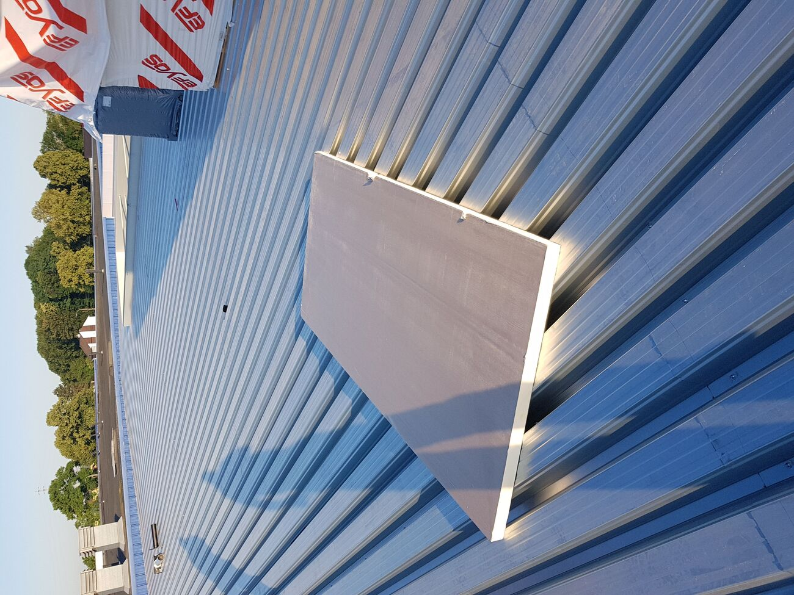
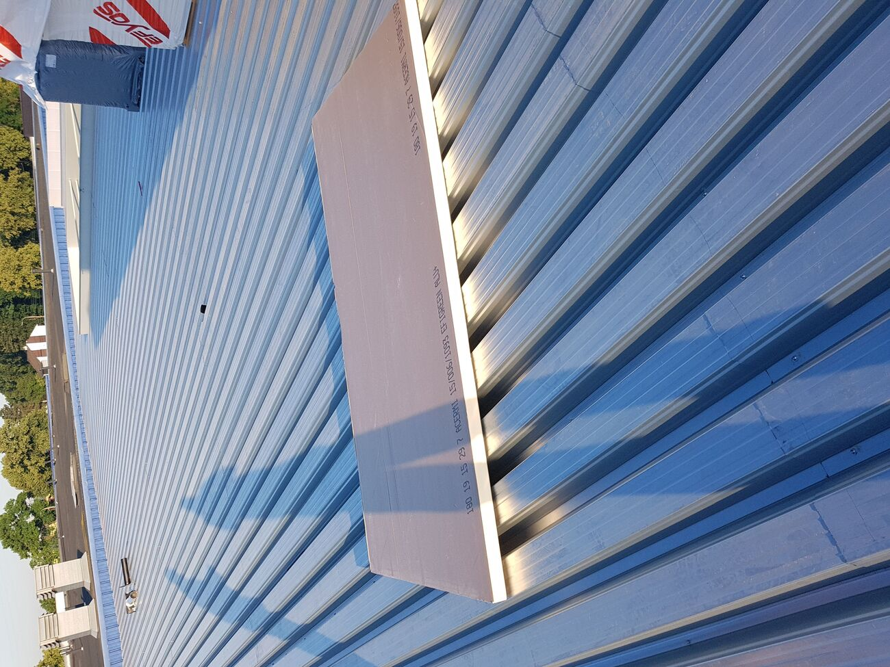
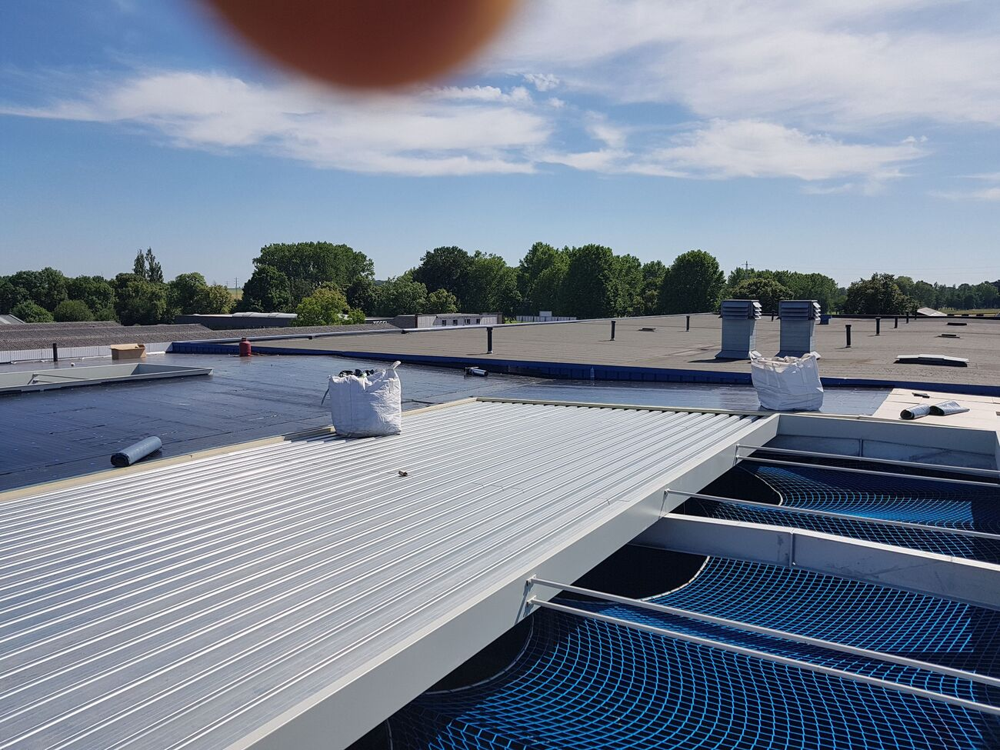

# LEKCJA 1.1 — KONSTRUKCJE DACHÓW PŁASKICH

## CZĘŚĆ 2: KONSTRUKCJA STALOWA — STAALDEK (profielplaten)

---

## 🤔 Przypomnienie: po co znamy konstrukcję w kursie o papie?

W części 1 (drewno) tłumaczyliśmy że **konstrukcja to fundament wszystkich Twoich decyzji** na dachu. Ten sam temat tutaj — bo **staaldek to specyficzne, "delikatne" podłoże** które wymaga zupełnie innego myślenia niż drewno czy beton.

### 🎯 Co jest UNIKALNE dla staaldeku w kontekście papy:

**1. 🚫 NIGDY nie zgrzewaj papy bezpośrednio na staaldek!**
- Stal się **deformuje** od ognia (już od 200°C)
- Ryzyko **pożaru** od izolacji pod blachą
- **ZAWSZE** mechaniczne mocowanie lub klejenie na zimno

**2. 📦 NIGDY nie stawiaj palety papy w jednym miejscu na staaldeku!**
- Paleta papy = **800-1200 kg**
- Staaldek liczony "do milimetra" — punktowe obciążenie wgnie blachę
- **Rozdzielaj palety**, kładź **na gordingach**, najlepiej rozłóż rolki pojedynczo
- *Tip Mariusza z części 1: widziałem na żywo jak młody dakwerker postawił dźwigiem paletę na środku staaldeku — blacha się wygięła w łuk. Lekcja warta 2 dni opóźnienia.*

**3. 🌡️ Mostki termiczne — gordingen przebijają izolację**
- Każdy stalowy gording = **mostek termiczny** = kondensacja od spodu
- Wymaga **termoonderbreking** (przekładki termicznej) lub ciepłego dachu

**4. ⚙️ Mocowanie papy = mechaniczne przez izolację**
- **Nie kleisz** papy bezpośrednio do staaldeku
- Mechaniczne mocowanie **przechodzi przez** PIR/wełnę aż do blachy
- Ilość kotew zależy od **windzuiging** w narożach (3× więcej niż centrum!)

**5. 🔇 Staaldek wzmacnia hałas — papa nie pomaga**
- Zwykły staaldek = **bęben** (deszcz, kroki słychać)
- Wymaga: wełna mineralna pod papą + ewentualnie wersja perforowana

**6. 🏗️ Co możesz robić nad staaldekiem?**
- ✅ Zwykły dach z papą + PIR
- ✅ Sedum extensief (dla profili wysokich, po obliczeniach konstruktora)
- ⚠️ Sedum intensief — **rzadko**, tylko przy specjalnych konstrukcjach
- ❌ Dachy parkingowe — **NIE na staaldeku**

> 🔑 **Złota zasada:** **staaldek to nie beton.** Wszystko liczone, wszystko musi być rozłożone, każdy detal ma znaczenie. Kto myśli "stal to stal, wytrzyma" — kończy z reklamacją.

---

### 🎯 Po tej lekcji będziesz wiedział:
- Co to jest staaldek i kiedy go używamy
- Jakie są typy profili stalowych w Belgii (Joris Ide, SAB, ArcelorMittal)
- Jak dobrać profil i grubość blachy do rozpiętości i obciążenia
- Jakie są minimalne zakłady (eindoplegging, tussenoplegging)
- Maksymalne rozpiętości i ile dźwiga na m²
- Mocowanie: ile schroev na m², gdzie i jak
- Jak prawidłowo składować materiały na staaldeku
- Najczęstsze błędy i ryzyka

---

## 1. CO TO JEST I KIEDY GO UŻYWAMY

**Staaldek** (po niderlandzku też: *profielplaat dak*, *staalplaat dak*, *steeldeck*) to **stalowa blacha trapezowa** używana jako konstrukcja nośna dachu płaskiego — zamiast drewna lub betonu.

**Zastosowanie typowe:**
- 🏭 **Hale przemysłowe** i magazyny
- 🛒 **Supermarkety, centra handlowe**
- 🏟️ **Hale sportowe**
- 🚗 **Garaże podziemne / parkingi (warstwa wierzchnia)**
- 🏢 **Biurowce** (zwłaszcza dolne kondygnacje)
- 🐄 **Budynki rolnicze** (z odpowiednią powłoką antyamoniakową!)


*Wielka hala przemysłowa: profielplaten (staaldek), płyta PIR EFIGREEN ALU+ ułożona na bergach profilu. W tle pakiet izolacji EFYOS. To realna realizacja z budowy.*


*Pojedyncza płyta PIR — widoczny nadruk EFIGREEN ALU+ (180×19, λ=0,022). Leży na bergach trapezu, nigdy w dolinie. Pakiet EFYOS w prawym górnym rogu.*


*Świeżo ułożony staaldek z niebieskimi siatkami zabezpieczającymi (vangnetten) od spodu — obowiązkowe przy pracy na blasze. W tle gotowa część dachu z papą.*

> 🎯 **Te zdjęcia to autentyczna realizacja z naszej budowy** — typowa belgijska hala przemysłowa: profil **Joris Ide** (najprawdopodobniej **JI 106-250-750**), izolacja **EFISOL EFIGREEN ALU+** (PIR z folią aluminiową), zabezpieczenie **vangnetten (niebieskie siatki bezpieczeństwa)** od spodu. **Dokładnie to o czym piszemy w tej lekcji widać na żywo.**

### ⚡ Dlaczego staaldek?

**ZALETY:**
- ✅ **Wielkie rozpiętości BEZ podpór** — typowe 4-7 m, dla profili wysokoprofilowych nawet 12+ m
- ✅ **Lekkość** — 8-12 kg/m² (vs beton ~250 kg/m², drewno ~25 kg/m²)
- ✅ **Szybki montaż** — całe hale w 1-2 dni
- ✅ **Dokładne wymiary** — produkcja fabryczna, brak skurczu/wypaczeń
- ✅ **Akustyka** — wersje perforowane (perfo) tłumią dźwięk
- ✅ **Trwałość** — przy poprawnej ochronie 50-80 lat
- ✅ **Brak czasu schnięcia** — od razu można izolować

**WADY / OGRANICZENIA:**
- ❌ **Akustyka u zwykłego staaldeku** — wzmacnia dźwięki (deszcz, kroki)
- ❌ **Korozja** — wymaga powłoki ochronnej, w środowisku rolniczym specjalna
- ❌ **Mostki termiczne** — przy nieprawidłowej izolacji
- ❌ **Niemożliwy w domach mieszkalnych** (akustyka, estetyka)
- ❌ **Wymaga konstrukcji nośnej** (gordingen / belki stalowe lub drewniane)
- ❌ **Brand:** stal traci wytrzymałość przy >500°C (potrzeba dodatkowych zabezpieczeń)

---

## 2. RODZAJE PROFILI STAALDEK W BELGII

W Belgii najczęściej spotykane są profile **Joris Ide**, **ArcelorMittal**, **SAB-profiel**, **Sadef**. Numeracja profilu mówi o jego **wysokości w mm**.

### 🔹 Profile niskie (laagprofiel) — do 60 mm wysokości

Stosowane przy mniejszych rozpiętościach lub jako poszycie pod kompletny system warstwowy.

| Typ | Wysokość | Typowa rozpiętość | Zastosowanie |
|-----|----------|-------------------|--------------|
| **JI 37-265-1060** | 37 mm | do 3,5 m | dach lekki, garaże, zadaszenia |
| **JI 42-252-1010** | 42 mm | do 4,0 m | małe hale, magazyny |
| **JI 60-160-800** | 60 mm | do 4,5 m | średnie hale |

### 🔸 Profile średnie (middenprofiel) — 80-110 mm

Najczęstszy wybór dla typowych hal przemysłowych w Belgii.

| Typ | Wysokość | Typowa rozpiętość | Zastosowanie |
|-----|----------|-------------------|--------------|
| **JI 85-280-1120** | 85 mm | do 6,0 m | hale standardowe |
| **JI 106-250-750** | 106 mm | do 7,5 m | hale z większą rozpiętością |

### 🔺 Profile wysokie (hoogprofiel) — 130-160 mm

Do dużych hal logistycznych, magazynów, fabryk.

| Typ | Wysokość | Typowa rozpiętość | Max. długość płyty |
|-----|----------|-------------------|---------------------|
| **JI 135-310-930** | 135 mm | do 9,0 m | 24 m |
| **JI 153-280-840** | 153 mm | do 10,5 m | 24 m |
| **JI 158-250-750** | 158 mm | do 12,0 m | **24 m** (!) |

> 🔑 **Tip Mariusza:** zauważyłeś że **wyższy profil = większa rozpiętość**, ale też **wyższy profil = lepiej cienki materiał ekonomicznie**. Cytując industriebouwen.be: *"Wanneer het dakpakket zo slank mogelijk moet zijn is enkel de 106-1,00mm een optie, maar met slechts 47mm extra valt er 20% van de prijs af"* — czasem taniej dać wyższy profil cieńszej blachy niż niższy grubszej.

### 🔇 Wersje perforowane (Perfo)

Większość profili dostępna w wersji **geperforeerd** — z dziurkami na ścianach trapezów.

**Po co?**
- Pochłaniają dźwięk (akustyka)
- W połączeniu z wełną mineralną zwiększają **brandweerstand**
- Stosowane w halach sportowych, biurowcach (gdzie hałas to problem)

**UWAGA:** *"Door geperforeerde platen dubbel te leggen, gaat de akoestische werking verloren!"* — perforowane płyty układane podwójnie tracą funkcję akustyczną.

---

## 3. GRUBOŚĆ BLACHY vs ROZPIĘTOŚĆ vs OBCIĄŻENIE

Standardowe grubości blachy: **0,75 / 0,88 / 1,00 / 1,25 mm**.

### 📊 Tabela praktyczna — JI 106-250-750 (popularny profil średni):

Bazując na oficjalnych danych Joris Ide (przy ugięciu max L/200, obciążenie kg/m²):

| Obciążenie (kg/m²) | Grubość 0,75 mm | Grubość 0,88 mm | Grubość 1,00 mm |
|--------------------|------------------|------------------|------------------|
| **60 kg/m²** | rozp. 4,86 m | rozp. 5,30 m | rozp. 5,66 m |
| **80 kg/m²** | rozp. 4,41 m | rozp. 4,82 m | rozp. 5,15 m |
| **100 kg/m²** | rozp. 4,09 m | rozp. 4,47 m | rozp. 4,78 m |
| **120 kg/m²** | rozp. 3,85 m | rozp. 4,21 m | rozp. 4,49 m |

**Jak to czytać:** np. profil **JI 106 grubości 0,88 mm** przy obciążeniu **100 kg/m²** udźwignie rozpiętość **4,47 m** bez ugięcia większego niż L/200.

### 📊 Ciężar własny profili (dla wyliczenia obciążenia całkowitego):

| Grubość blachy | JI 106-250-750 ciężar |
|----------------|------------------------|
| 0,75 mm | **8,83 kg/m²** |
| 0,88 mm | **10,36 kg/m²** |
| 1,00 mm | **11,78 kg/m²** |

> 💡 **Praktyka 2026:** dla typowej hali przemysłowej w Belgii (śnieg ~50 kg/m² + papa + izolacja PIR ~15 kg/m² + zapas + serwis) **całkowite obciążenie ~100-120 kg/m²**. Profil **JI 106 grubości 0,88-1,00 mm** to złoty środek dla rozpiętości 4-5 m.

### 🧮 Reguła praktyczna:

```
Większy profil + cieńsza blacha = lepiej dla dużych rozpiętości
Mniejszy profil + grubsza blacha = lepiej dla wysokich obciążeń punktowych
```

**Maksymalne dopuszczalne obciążenie** dla typowych profili w Belgii:
- Profil 37 mm grubość 1,00 mm = ~150-200 kg/m² na rozpiętości 2-3 m
- Profil 106 mm grubość 1,00 mm = ~250-300 kg/m² na rozpiętości 3 m
- Profil 158 mm grubość 1,25 mm = nawet **400 kg/m²** na rozpiętości 4-5 m

---

## 4. ROZPIĘTOŚCI — POJEDYNCZE vs DWUPRZĘSŁOWE

To jest **KLUCZOWE** dla projektowania:

### 🔹 Pojedyncze przęsło (enkelvelds)
- Płyta opiera się tylko na **2 końcach**
- Cała siła idzie w środek → **maksymalne ugięcie**
- **Mniejsza dopuszczalna rozpiętość** dla tej samej blachy

### 🔸 Dwuprzęsłowe lub więcej (dubbelvelds / meervelds) — ZALECANE!
- Płyta opiera się na **3+ podporach** (min. 2 przęsła)
- Ugięcie jednego przęsła kompensuje drugie → **konstrukcja sztywniejsza**
- Można wybrać **lżejszy typ** lub **cieńszą blachę** — oszczędność!
- Czas montażu też krótszy (mniej śrub na metr²)

> 🔑 **Dlatego zawsze projektuj dachy z minimum 2 przęsłami** jeśli to możliwe. Oszczędność może wynieść **15-20%** na samym staaldeku.

### 📏 Minimalne zakłady (oplegging) — KONKRETNE WARTOŚCI:

**Joris Ide oficjalna instrukcja:**
- **Eindoplegging** (zakład końcowy, na zewnętrznej podporze): minimum **160 mm**
- **Tussenoplegging** (zakład pośredni, na środkowej podporze): minimum **60 mm** przy meervelds

**Dlaczego tak duży zakład końcowy?**
1. Tam jest **maksymalne ścinanie** (afschuiving)
2. Profil może się **zsunąć z podpory** przy obciążeniach dynamicznych (wiatr)
3. Strefa zakotwienia musi być **stabilna** (śruby się trzymają tylko w pełnej blasze)

> ⚠️ **WAŻNE:** przy zamawianiu staaldeku **dodaj zakłady do długości**. Jeśli rozpiętość 4 m i pojedyncze przęsło → zamawiasz **min. 4,32 m** (4 m + 16 cm + 16 cm). Inaczej zostaniesz z brakami!

### 📐 Praktyczna zasada minimalnych zakładów:

| Typ podpory | Minimum eindoplegging | Minimum tussenoplegging |
|-------------|------------------------|--------------------------|
| Beton/mur | 160 mm | 60 mm |
| Stal (gording) | 100 mm | 60 mm |
| Drewno (rzadko) | 160 mm | 80 mm |

---

## 5. MOCOWANIE — PEŁNY ROZDZIAŁ

To **NAJWAŻNIEJSZA** sekcja w lekcji o staaldeku. Złe mocowanie = zerwany dach + odpowiedzialność cywilna + sąd. Dobre mocowanie = 50+ lat bez problemów.

### 🔩 5.1 Rodzaje śrub do staaldeku

W Belgii dominują 3 marki: **Hilti**, **SFS Group**, **EJOT**. Wszystkie mają zgodność z EN 14592 i ATG (Agrément Technique).

**KLUCZOWY ELEMENT KAŻDEJ ŚRUBY:** podkładka EPDM (sluitring met EPDM-rubber) — uszczelnia otwór, blokuje wodę.

### 📋 Typy śrub (wybór wg podłoża):

| Podłoże (gording) | Typ śruby | Średnica | Długość | Materiał |
|--------------------|-----------|----------|---------|----------|
| **Stal cienka <2 mm** | self-drilling z drillpoint #2 | 5,5 mm | 25-32 mm | RVS A2 lub bi-metaal |
| **Stal średnia 2-6 mm** | self-drilling z drillpoint #3 | 5,5-6,3 mm | 32-50 mm | RVS A2 lub bi-metaal |
| **Stal gruba 6-15 mm** | self-drilling z drillpoint #5 | 5,5-6,3 mm | 50-65 mm | RVS A2 lub bi-metaal |
| **Drewno (carport)** | self-drilling do drewna | 4,8-5,5 mm | 35-50 mm | RVS A2 |
| **Beton (rzadko)** | szyniony bolt + nylonowa kotwa | 6-8 mm | 60-100 mm | RVS A4 |

### 🔥 Materiał śruby — TO KLUCZOWE:

✅ **RVS A2** (304) — środowisko miejskie, wiejskie, normalne
✅ **RVS A4** (316) — środowisko **agresywne** (rolnictwo, basen, wybrzeże, fabryki chemiczne)
✅ **Bi-metaal** — łeb RVS + trzon hartowany (lepsza wytrzymałość mechaniczna)
✅ **Duplex coating** (Ruspert Silver, Magni 565) — alternatywa dla RVS w mniej agresywnych środowiskach
❌ **Galwanizowane (verzinkt)** — **NIE DLA DACHU** (galvanic corrosion + RVS staaldek = rdza w 2 lata)
❌ **Czarne kute** — absolutnie zabronione

> 🔑 **Tip Mariusza:** zawsze sprawdź czy w specyfikacji jest **RVS A2 minimum**. Galwanizowanych szuka się przez generalnych wykonawców do oszczędności — to **fałszywa oszczędność**, dachy się odbarwiają i klient ma reklamację po 2-3 latach.

---

### 🔩 5.2 Narzędzia — czym przykręcamy

**🔧 Akumulatorowa wkrętarka udarowa**:
- Min. 18V (Milwaukee, Hilti, Makita, DeWalt)
- **Z regulacją momentu obrotowego** (clutch / koppelkoppeling)
- Specjalny **bit z magnesem** (Hilti SDT 9, Hilti ST 1800)
- **Stand-up tool** (z długim trzonem) dla dużych powierzchni — masz pionową pozycję, oszczędzasz plecy

**🚫 Czego NIE używać:**
- Slagschroevendraaier (klucz udarowy) **bez regulacji momentu** — przekręca i niszczy EPDM
- Wiertarka udarowa standardowa — drilluje za szybko, łeb się ugina

**⚙️ Moment obrotowy:**
- Za mały → śruba nie dosiada → przeciek
- Za duży → EPDM zgnieciony do końca → pęka po zimach → przeciek
- **Idealnie:** EPDM "lekko" wyciśnięty na zewnątrz, nie zgnieciony do końca

---

### 🔩 5.3 Gdzie mocujemy — ANATOMIA TRAPEZU

Staaldek ma 2 strefy:
- **BERG (top, góra)** = wysoki punkt profilu — TUTAJ ŚRUBA
- **DAL (golf, dolina)** = niski punkt profilu — TUTAJ PŁYNIE WODA → NIGDY ŚRUBY!

> 🚨 **ZASADA ŻELAZNA:** śruba na dachu **ZAWSZE NA BERGU**. Jedyne wyjątek: ściany boczne (gevel) — tam można w dolinie, bo woda nie stoi.

### 📊 Schemat mocowania na profilu:

```
Profil JI 106-250-750:
                   ┌──┐    ┌──┐    ┌──┐
                   │BG│    │BG│    │BG│   ← BERG (mocowanie)
                  ─┘  └────┘  └────┘  └─
                   DL      DL      DL    ← DAL (NIE!)
                   
ŚRUBY: ✓ na BG (góra)
       ✗ na DL (dolina, płynie woda)
```

### 🧮 5.4 Jak gęsto — schematy mocowania

**Schemat "co druga górka" (om de andere golf):**
- Standard dla strefy centralnej
- **5-6 śrub na m²**
- Sufit przy obciążeniu maks. 60-80 kg/m²

**Schemat "każda górka" (elke golf):**
- Strefa krawędziowa i naroża
- **8-12 śrub na m²**
- Wytrzymuje obciążenie do 150 kg/m² i ssanie wiatru w narożach

**Schemat "co trzecia górka":**
- Tylko strefa centralna małych dachów (carport)
- **3-4 śruby na m²**
- Maks. 40-50 kg/m²

### 📍 Specyficzne strefy:

| Strefa | Schemat | Śruby/m² |
|--------|---------|----------|
| **Centrum dachu** | co druga górka | 5-6 |
| **Krawędź dachu** (1-2 m od kraj) | co druga górka + dodatkowa rzędem | 8-10 |
| **Naroża dachu** (zone "F" wg EN 1991-1-4) | każda górka | 12-15 |
| **Łączenia płyt boczne (zijoverlap)** | co 50 cm | osobny ciąg |
| **Łączenia płyt wzdłużne (eindoverlap)** | każda górka | dodatkowy ciąg |

> 💡 **Buildwise potwierdza:** *"De randzone moet bestand zijn tegen hogere windkrachten"* — strefa krawędziowa MUSI być wzmocniona przeciw siłom wiatru. To nie sugestia, to wymóg.

---

### 🔩 5.5 Łączenia boczne (zijoverlap) — STITCHING SCREWS

Płyty staaldek **zachodzą na siebie** wzdłuż boku — minimum **50 mm**, ale lepiej **70-100 mm** dla pewności.

**Po co stitching screws (śruby spinające)?**
- Łączą **dwie sąsiednie płyty** ze sobą
- Sprawiają że dach pracuje jako **jedna sztywna tarcza** (a nie luźne płyty)
- Wzmacniają usztywnienie poziome (tarczę dachu)
- Bez nich: w wietrze płyty się "klepią" i powstają nieszczelności

**Specyfikacja:**
- **Co 50 cm wzdłuż łączenia bocznego**
- Specjalne **stitching screws** (krótsze, bez drillpoint, z EPDM)
- Średnica **4,8-5,5 mm**, długość **20-25 mm**

### 📐 5.6 Łączenia wzdłużne (eindoverlap) — kierunek wody

Gdy płyty są krótsze niż dach → łączymy **w kierunku spadku wody** (wodospływ na nakładce).

**Reguła:** woda musi spływać Z górnej płyty NA dolną (nakładka jak dachówka).

- **Wielkość zakładu wzdłużnego:** minimum **150 mm** dla spadku >5%, **200 mm** dla spadku 2-5%
- **Mocowanie:** śruby na **każdej górce** w strefie zakładu — DUBLOWANE (przez obie warstwy blachy + gording)
- **Uszczelnienie:** taśma butylowa lub silikon dachowy między warstwami zakładu

> ⚠️ **NIGDY** zakład wzdłużny w połowie rozpiętości — tylko nad gordingiem!

---

### 🔩 5.7 Stała głębokość wkręcenia (vaste inbrengdiepte)

**Nowoczesne systemy SFS BSA / Hilti S-MS** mają **plastikową tulejkę (kunststof tule)** która:
- Gwarantuje stałą głębokość wkręcenia w stal (typowo **20 mm**)
- Tworzy **przerwę termiczną (koudebrug onderbreking)**
- Pozwala na "ruchy" dachu bez zerwania śruby
- Ułatwia **demontaż w przyszłości** (cyrkularność)

To rozwiązanie zalecane dla nowych dachów wg standardów 2025+.

---

### 🔩 5.8 Praktyczna kolejność mocowania (workflow)

1. **Rozkładamy** pierwszą płytę w narożniku, sprawdzamy **prostopadłość do gordingen**
2. **Mocujemy 4 narożne śruby** (lekko, bez dociągania) — żeby ustabilizować płytę
3. **Sprawdzamy poziom** i wyrównanie z linią dachu
4. **Dociągamy narożne** śruby z odpowiednim momentem
5. **Mocujemy zewnętrzne krawędzie** wg schematu (każda górka po obwodzie)
6. **Mocujemy centrum** wg schematu (co druga górka)
7. **Kładziemy następną płytę** — z zakładem 50-100 mm
8. **Stitching screws** wzdłuż łączenia bocznego co 50 cm
9. **Powtarzamy** aż do końca

> 🔑 **Tip Mariusza:** **wszystkie śruby tej samej długości na danej hali**. Mieszanie długości na jednym dachu = chaos w magazynie + możliwe pomyłki. Lepiej zamówić jedną długość na każdą strefę.

---

### 🔩 5.9 Najczęstsze błędy mocowania

| Błąd | Co się dzieje | Jak naprawić |
|------|----------------|--------------|
| Śruba w dolnej fali (DAL) | Woda przesiąka, EPDM nie chwyta | Wykręcić, zaślepić rivet+silikon, dodać śrubę na BERGU |
| Za mocno dokręcona (zgnieciony EPDM) | EPDM pęka po zimach, przecieka | Wymienić śrubę (nowa EPDM) |
| Galwanizowana zamiast RVS | Rdza wokół po 1-2 latach | Wymienić wszystkie na RVS A2 |
| Brak stitching screws na boku | Dach klepie w wietrze | Dorobić co 50 cm |
| Zakład wzdłużny w polu (nie na gordingu) | Pęka pod własnym ciężarem | Bardzo trudna naprawa — może wymagać wymiany płyty |
| Zbyt mało śrub w narożach | Dach zerwany w pierwszą wichurę | Dospinać + dosadzić |

---

## 6. KONSTRUKCJA NOŚNA POD STAALDEKIEM

Staaldek **NIE jest konstrukcją samodzielną** — leży na czymś:

### 🔻 Gordingen (płatwie)

To **drugorzędne belki** podtrzymujące staaldek:
- **Stalowe profile IPE / HEA / koker (kanthout)** — najczęstsze
- **Drewno klejone (gelamelleerd)** — przy mniejszych halach
- Rozstaw **h.o.h. = rozpiętość staaldeku** (np. 4-6 m)

### 🔻 Główne ramy / kratownice (vakwerken)

Belki nośne ujmujące cały budynek:
- **Stal walcowana** (IPE 300-600, HEA 300-700)
- **Kratownice stalowe** (vakwerk) dla wielkich rozpiętości >20 m
- Spawane lub **śrubowane** (bouten) na placu

### 🔻 Słupy nośne

Pionowe konstrukcje przekazujące siły z dachu na fundament:
- **Stal HEA / HEB** dla hal przemysłowych
- **Beton zbrojony** dla bardzo dużych obciążeń
- **Drewno klejone** dla architektonicznie ekspozycyjnych obiektów

> 📌 **Pamiętaj:** w tej lekcji omawiamy SAM staaldek. Konstrukcję nośną pod nim (słupy, ramy, gordingen) projektuje **konstruktor budowlany** (ingenieur stabiliteit) wg Eurocode 3 (EN 1993).

---

## 7. SPADEK DACHU NA STAALDEKU

> 🚨 **Pamiętasz zasadę z poprzedniej lekcji?** Konstrukcja w POZIOMIE — spadki osobno!

### Jak robić spadek na staaldeku:

✅ **Opcja 1: Pochylenie WSZYSTKICH gordingen** (cały dach)
- Gordingen mają **różne wysokości** (np. 30 cm vs 35 cm)
- Staaldek leży w **JEDNEJ płaszczyźnie** (cały na pochyleniu)
- To rzadkie i drogie

✅ **Opcja 2: Afschotisolatie (PIR ze spadkiem)** ⭐ STANDARD
- Staaldek **w poziomie**
- Na nim PIR z fabrycznym spadkiem 1,5-2%
- Dziś **najczęstsze rozwiązanie** w Belgii dla nowych hal

✅ **Opcja 3: Dak met meerdere afvoeren** (wiele odpływów)
- Płyty staaldeku dzielone na sekcje
- Każda sekcja ma swój odpływ na środku
- Spadek 1-2% z każdej strony do odpływu

❌ **NIGDY:** nie pochylaj samego staaldeku w sposób przypadkowy bez konstrukcji obliczonej!

### 💧 Minimum spadek wg Buildwise TV 280: **2%**

Dla dachów staaldek ze względu na **profile trapezowe i ryzyko stagnacji wody w górnych zagłębieniach** — niektórzy producenci wymagają **minimum 3%**.

**Joris Ide profile perforowane (Perfo):** *"voor platte daken met een minimale helling van 3%"*.

---

## 8. ⚠️ RYZYKA — CO MOŻE PÓJŚĆ ŹLE

### 1️⃣ **Korozja**
**Przyczyna:** uszkodzona powłoka, środowisko agresywne (rolnictwo, basen), zaniedbanie.
**Skutek:** rdza → przebicia → wymiana całych połaci (drogie).
**Zapobieganie:**
- Powłoka **galvanizacji ocynkowej (Z275)** minimum
- W środowisku rolniczym: **specjalna powłoka antyamoniakowa**
- Coroczna kontrola, zwłaszcza w narożach i przy odpływach

### 2️⃣ **Korozja przy śrubach (rdza wokół śruby)**
**Przyczyna:** użyto śrub **galwanizowanych** zamiast **RVS** lub **bi-metaal**.
**Skutek:** rdzawe plamy wokół każdej śruby po 1-2 latach (galvanic corrosion).
**Zapobieganie:** **TYLKO RVS A2/A4** lub **bi-metaal**. Galwanizowanych nigdy.

### 3️⃣ **Mostki termiczne na gordingach**
**Przyczyna:** stalowe gordingen przebijają izolację.
**Skutek:** **kondensacja na gordingach** od spodu → mokre wnętrze → grzyb.
**Zapobieganie:**
- **Termoonderbreking** (wkładki termiczne pomiędzy staaldek a gording)
- Albo **system ciepłego dachu (warm dak)** — izolacja CIĄGŁA na staaldeku

### 4️⃣ **Niewłaściwe mocowanie na narożach (windzuiging)**
**Przyczyna:** "wszędzie ta sama gęstość śrub".
**Skutek:** w pierwszej burzy **dach się zrywa** od narożników.
**Zapobieganie:** **3× więcej śrub na narożach** vs centrum. Liczone wg EN 1991-1-4.

### 5️⃣ **Stagnacja wody (waterophoping)**
**Przyczyna:** zbyt mały spadek + ugięcie staaldeku z czasem.
**Skutek:** woda stoi w trapezach → **dodatkowe obciążenie** (1 cm wody = 10 kg/m²!) → **dalsze ugięcie** → spirala śmierci.
**Zapobieganie:**
- Minimum spadek 2-3%
- Sprawdź **doorbuiging** w obliczeniach (max L/250 lub L/300)
- Regularne czyszczenie odpływów (afvoeren)

### 6️⃣ **Akustyka — staaldek wzmacnia hałas**
**Przyczyna:** zwykły staaldek to bęben — deszcz słychać jak grad.
**Skutek:** w halach sportowych, biurowcach, halach z ludźmi = problem.
**Zapobieganie:**
- **Wersja perforowana (Perfo)** + wełna mineralna pod spodem
- Powłoka antyhałasowa (akoestische coating) na spodzie staaldeku

### 7️⃣ **Brand — stal traci wytrzymałość przy wysokich temp.**
**Przyczyna:** stal niezabezpieczona ognioodpornie + pożar w hali.
**Skutek:** staaldek się **zwija** już przy 500-600°C → zawalenie dachu.
**Zapobieganie:**
- Powłoki **brandwerend** (intumescentne) na konstrukcji nośnej
- Wełna mineralna jako **brandweerstand** od spodu
- **Brandcompartimentering** w dużych halach

---

## 9. 🛠️ JAK WYDŁUŻYĆ ŻYWOTNOŚĆ STAALDEKU

| Działanie | Zysk żywotności |
|-----------|-----------------|
| Powłoka galvanizacja Z275 minimum | +20 lat |
| Powłoka antyamoniakowa (rolnictwo) | +30 lat |
| Śruby RVS A2 zamiast galwanizowanych | +15 lat (brak rdzy lokalnej) |
| Spadek dachu min 3% (zamiast 2%) | +∞ (brak stagnacji) |
| Termoonderbreking pod gordingami | +10 lat (brak kondensacji) |
| 2-3× więcej śrub w narożach | bezcenne (brak zerwania) |
| Coroczna kontrola odpływów | +10 lat |
| Zakłady min 160 mm końcowe | bezcenne (stabilność) |

**Rzetelnie zaprojektowany i wykonany staaldek = 50-80 lat żywotności.**

---

## 10. 🎯 CZYM SIĘ SUGEROWAĆ PRZY WYBORZE

Klient pyta *"drewno czy staaldek?"* — twoja checklista:

| Kryterium | Drewno | Staaldek |
|-----------|--------|----------|
| Hala przemysłowa >100 m² | ❌ za drogo | ✅ TAK |
| Dom mieszkalny | ✅ TAK | ❌ akustyka, estetyka |
| Rozpiętość >7 m | ⚠️ tylko klejone | ✅ TAK do 12 m |
| Budżet ograniczony | ✅ TAK | ⚠️ podobnie |
| Czas: dni vs tygodnie | drewno 2-3 dni | ✅ staaldek 1-2 dni |
| Akustyka ważna | ⚠️ słabo | ⚠️ tylko Perfo + wełna |
| Środowisko agresywne (NH3, basen) | ❌ NIE | ✅ z odpowiednią powłoką |
| Architektura "ciepła" | ✅ TAK | ❌ przemysłowe |
| Ognioodporność | ⚠️ z zabezpieczeniem | ⚠️ z brandwerend coating |

### 🔑 Pytania do klienta PRZED wyceną:
1. **Jaka rozpiętość bez podpór?** (decyduje typ profilu)
2. **Jakie obciążenie?** (śnieg + PV + ewentualnie ruch)
3. **Środowisko?** (rolnicze, przybrzeżne, miejskie)
4. **Akustyka?** (zwykły vs Perfo)
5. **Brandweerstand?** (Rf 30/60/120 min)
6. **Czy będą PV?** (dodatkowe obciążenie + punkty mocowań)
7. **Spadek?** (min 2-3%, idealnie 3%)

> 💡 **Tip Mariusza:** zawsze **rób fotografie** układania staaldeku przed izolacją. W razie reklamacji widać kierunek mocowania, ilość śrub, zakłady. Twoja gwarancja prawna.

---

## 11. 📋 NORMY KTÓRE MUSISZ ZNAĆ

- **Buildwise TV 280** — *Het platte dak* (2022, ogólne wymagania dachów płaskich)
- **Buildwise TV 244** — *Aansluitingsdetails bij platte daken* — detale, attyki, przejścia
- **EN 1993 (Eurocode 3)** — projektowanie konstrukcji stalowych
- **EN 1991-1-3** — obciążenia śniegiem (Belgia: strefy A, B, C, D)
- **EN 1991-1-4** — obciążenia wiatrem (windzone F, G, H, I)
- **NBN-EN 1991-1-4 ANB** — belgijska załącznik narodowy do wiatru
- **EN 14782** — staaldek profilowany walcowany na zimno (specyfikacja techniczna)
- **EN 508-1** — płyty stalowe dachowe (wymagania)

**Dokumentacja producenta** (niezbędna na każdą halę):
- Joris Ide: *Belgische catalogus* (overspanningstabellen, wartości doorbuiging)
- SAB-profiel: *Technisch handboek*
- ArcelorMittal: technical data sheets

---

## 🧪 QUIZ — sprawdź się

**1. Jaka jest minimalna eindoplegging (zakład końcowy) staaldeku wg Joris Ide?**
- A) 60 mm
- B) 100 mm
- C) 160 mm
- D) 250 mm

**2. Profil JI 106-250-750 oznacza:**
- A) wysokość 106 cm × szerokość 250 cm × długość 750 cm
- B) wysokość 106 mm × szerokość użytkowa 750 mm × rozstaw fal 250 mm
- C) ciężar 106 kg × pole 250 m² × ilość 750 sztuk
- D) klasa 106 ogniowa × klasa 250 wiatrowa × klasa 750 wodna

**3. Gdzie zawsze mocujemy śruby na staaldeku dachowym?**
- A) W dolnym garbku (dal) — najgłębszej części
- B) Na wysokim punkcie profilu (berg/top) — woda spływa obok
- C) Wszędzie po równo
- D) Tylko w narożach

**4. Jak zmienia się ilość śrub na narożach dachu?**
- A) Tak samo jak w centrum
- B) Mniej (mniej obciążenia)
- C) 2-3× więcej (windzuiging — ssanie wiatru)
- D) Tylko więcej w połowie krawędzi

**5. Dla typowej hali w Belgii (śnieg + papa + PIR + serwis = ~100-120 kg/m²) i rozpiętości 5 m, najlepszy profil to:**
- A) JI 37-265-1060 grubość 0,75 mm
- B) JI 106-250-750 grubość 0,88-1,00 mm
- C) JI 158-250-750 grubość 1,25 mm
- D) JI 60-160-800 grubość 0,75 mm

**6. Staaldek dwuprzęsłowy (dubbelvelds) w porównaniu do pojedynczego (enkelvelds):**
- A) Słabszy — więcej zakładów
- B) Sztywniejszy, można cieńszą blachę → oszczędność
- C) Tylko do dekoracji
- D) Wymaga większego spadku

**7. Jaki rodzaj śrub MUSZĄ być stosowane na staaldeku w środowisku zewnętrznym?**
- A) Galwanizowane (verzinkt)
- B) RVS A2/A4 lub bi-metaal
- C) Czarne kute
- D) Wystarczą czarne wkręty do drewna

**8. Co to jest staaldek "Perfo"?**
- A) Specjalna powłoka antyrdzewna
- B) Wersja perforowana (z dziurkami) dla akustyki
- C) Wzmocniona wersja dla dużych rozpiętości
- D) Bez powłoki — surowa stal

**9. Maksymalna rozpiętość JI 158-250-750 to około:**
- A) 3 m
- B) 6 m
- C) 12 m
- D) 24 m

**10. Stagnacja wody (waterophoping) na staaldeku jest niebezpieczna bo:**
- A) Pęka stal od mrozu
- B) 1 cm wody = 10 kg/m² dodatkowego obciążenia → spirala śmierci ugięcia
- C) Tylko niszczy wygląd
- D) Wymaga częstszego sprzątania

---

### Odpowiedzi i wyjaśnienia:

**1. C — 160 mm** — Joris Ide oficjalnie wymaga min. 16 cm zakładu na końcach. Tussenoplegging tylko 60 mm wystarczy.

**2. B — wysokość 106 mm × szerokość użytkowa 750 mm × rozstaw fal 250 mm** — to standardowa notacja: numer 1 (wysokość profilu w mm) - numer 2 (szerokość fali w mm) - numer 3 (szerokość użytkowa w mm).

**3. B — Na wysokim punkcie (berg/top)** — w dolnym garbku płynie woda → dziura = przeciek. Berg to standard.

**4. C — 2-3× więcej** — wg EN 1991-1-4 strefa narożnikowa może mieć ssanie 3× większe niż centrum. Trzeba dodać śruby.

**5. B — JI 106-250-750 grubość 0,88-1,00 mm** — to złoty standard. Profil 37 mm za słaby, 158 mm to przesada.

**6. B — Sztywniejszy, można cieńszą blachę** — sąsiednie przęsło "podtrzymuje" → mniejsze ugięcie → oszczędność na blasze.

**7. B — RVS A2/A4 lub bi-metaal** — galwanizowane korrodują przy kontakcie ze stalą staaldeku, robi się rdza wokół śrub. Tylko RVS lub bi-metaal.

**8. B — Wersja perforowana** — dziurki w bocznych falach pochłaniają dźwięk. Stosowane w halach sportowych, biurach.

**9. C — 12 m** — JI 158-250-750 dźwiga do 12 m rozpiętości. Maksymalna **długość płyty** to 24 m, ale to inna sprawa.

**10. B — 1 cm wody = 10 kg/m²** — woda + ugięcie staaldeku → coraz więcej wody → coraz większe ugięcie → zawalenie. Dlatego spadek MUSI być min. 2-3%.

---

## 📌 PODSUMOWANIE LEKCJI

✅ Staaldek = stalowa blacha trapezowa, do hal, magazynów, supermarketów
✅ Profile: niskie (37-60 mm), średnie (85-110 mm), wysokie (135-160 mm)
✅ Najczęstsze w Belgii: **Joris Ide JI 106** (uniwersalny standard)
✅ Grubości blachy: 0,75 / 0,88 / 1,00 / 1,25 mm
✅ Reguła: **wyższy profil + cieńsza blacha = oszczędność na dużych rozpiętościach**
✅ **Minimum eindoplegging 160 mm**, tussenoplegging 60 mm
✅ Mocowanie **NA BERGU** (góra trapeza), nigdy w dolinie
✅ **5-6 śrub/m² w centrum, 8-10 na krawędziach, 12-15 na narożach** (windzuiging!)
✅ Tylko **RVS A2/A4 lub bi-metaal** śruby — nigdy galwanizowane
✅ **Stitching screws co 50 cm** wzdłuż łączeń bocznych
✅ Zakład wzdłużny **min 150-200 mm w kierunku spływu wody**, ZAWSZE nad gordingiem
✅ **Plastikowa tulejka** (Hilti S-MS, SFS BSA) = przerwa termiczna + cyrkularność
✅ Dwuprzęsłowy (dubbelvelds) > pojedynczy (enkelvelds)
✅ Spadek min 2% wg TV 280, 3% dla profili Perfo
✅ Staaldek **w poziomie**, spadki przez afschotisolatie lub gordingen z różnymi wysokościami
✅ Korozja, akustyka, mostki termiczne, brand — to 4 główne wyzwania
✅ Żywotność 50-80 lat przy poprawnym wykonaniu

---

**W następnej części lekcji 1.1:** Konstrukcja BETONOWA — predalle, monolit, prefabrykat (czekamy na Twoje zdjęcia z OneDrive).
