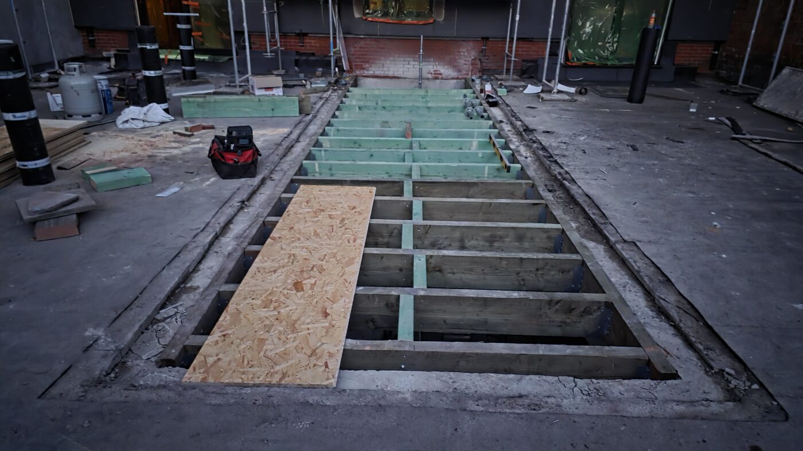
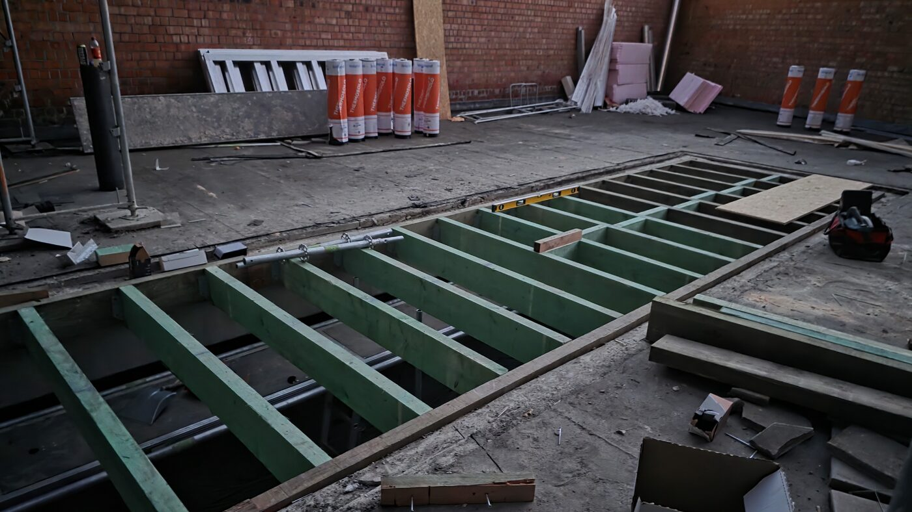
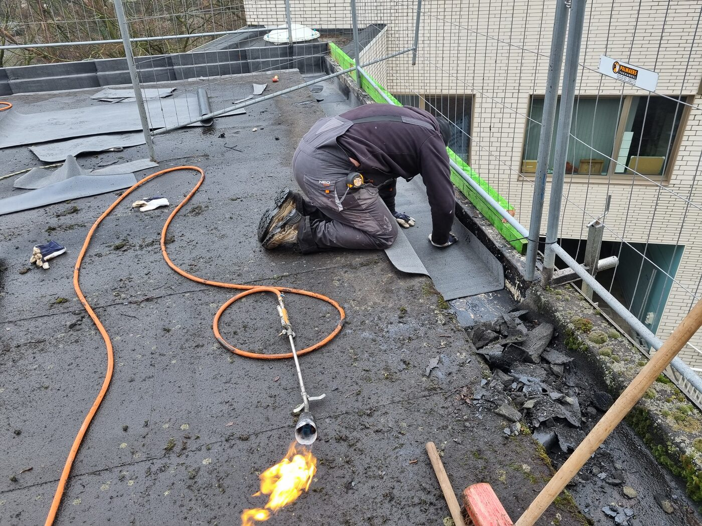
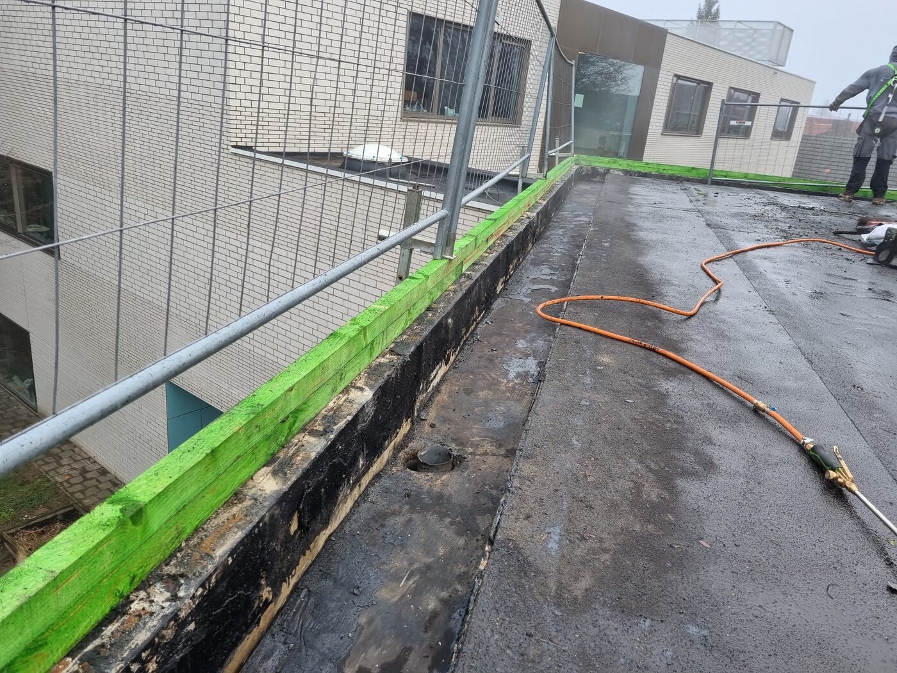

# LEKCJA 1.1 — KONSTRUKCJE DACHÓW PŁASKICH

## CZĘŚĆ 3: KONSTRUKCJA BETONOWA (Betonnen dakconstructie)

---

## 🤔 Przypomnienie: po co znamy konstrukcję w kursie o papie?

Tak jak przy drewnie i staaldeku — **konstrukcja decyduje o wszystkim co robisz z papą na górze.** Beton ma swoją specyfikę, która zmienia Twoje decyzje:

### 🎯 Co jest UNIKALNE dla betonu w kontekście papy:

**1. 🔥 Otwarty ogień — jedyna konstrukcja gdzie wolno**
- Drewno/OSB → ❌ nie zgrzewasz bezpośrednio (pożar)
- Staaldek → ❌ nie zgrzewasz bezpośrednio (deformacja)
- **Beton → ✅ możesz zgrzewać palnikiem** — nie spalisz konstrukcji

**2. 💧 Wilgoć budowlana — największa ze wszystkich konstrukcji**
- Beton oddaje wodę **tygodniami**, nie dniami
- Położysz papę na mokry beton → pęcherze (blazen), odklejona paroizolacja
- To jedyna konstrukcja gdzie czekasz aż **podłoże wyschnie**, a nie tylko aż przestanie padać

**3. 📦 Składowanie — pełna swoboda**
- Drewno → palety tylko na belkach nośnych
- Staaldek → nigdy ciężaru punktowego (wgina blachę!)
- **Beton → palety gdziekolwiek**, masz ogromny zapas nośności

**4. 🌿 Zielony dach / parking — wszystko możliwe**
- Beton uniesie dach zielony intensywny, taras, parking — czego drewno i staaldek nie udźwigną

**5. 🔇 Akustyka — beton tłumi dźwięk**
- Dlatego apartamentowce mają stropy betonowe między piętrami

---

> 🔑 **Tip Mariusza:** Beton to najwygodniejsza konstrukcja do pracy z papą — ogień wolno, palety gdzie chcesz, zapas nośności ogromny. Ale ma jeden haczyk którego nie ma drewno ani staaldek: **wilgoć w środku.** Zlekceważysz wysuszenie — pęcherze gwarantowane. Dlatego przy betonie najpierw pytanie brzmi: **czy ten beton już wysechł?**

---

### 🎯 Po tej lekcji będziesz wiedział:
- Jakie typy stropów betonowych spotkasz w Belgii i czym się różnią
- Jakie **realne grubości** (cm) i **rozpiętości** (m) mają welfsels i predalle
- Jaką **nośność w kg/m²** dają poszczególne stropy — i co to znaczy dla dachu
- Kiedy potrzebujesz **druklaag** (warstwy dociskowej), a kiedy nie
- Dlaczego beton daje **największy zapas nośności** ze wszystkich konstrukcji
- Jak rozpoznać typ stropu na budowie i co zamawiać
- **Jak Twoje decyzje przy dachu zmieniają się na betonie** w porównaniu z drewnem i staaldekiem

---

## 1. CO TO JEST KONSTRUKCJA BETONOWA I KIEDY JĄ STOSUJEMY

**Strop betonowy** to najcięższa i najbardziej nośna podstawa pod dach płaski. Stosujemy go gdy:
- budynek **mieszkalny wielorodzinny** (apartamenty — beton tłumi dźwięk między piętrami)
- **budynki użyteczności publicznej** (szkoły, biura, woonzorgcentra)
- **przemysł i magazyny** z dużymi obciążeniami i siłami dynamicznymi
- **parkingi, dachy użytkowe, tarasy intensywne** (ruch pieszy/kołowy)
- **dachy zielone intensywne** (ziemia + krzewy + drzewa, nie tylko sedum)
- wszędzie tam gdzie drewno czy staaldek **nie udźwigną** obciążenia

### Dlaczego beton?
- ✅ **Ogromna nośność** — od 350 do nawet 5000 kg/m² (sprężony)
- ✅ **Duże rozpiętości** — sprężony do 20 m
- ✅ **Akustyka** — tłumi dźwięk (kluczowe w apartamentach)
- ✅ **Ognioodporność** — beton nie pali się
- ✅ **Trwałość** — strop przeżyje wiele pokryć dachowych
- ✅ **Otwarty ogień dozwolony** — możesz zgrzewać papę bezpośrednio (nie spalisz jak drewno/blacha)

### ⚠️ Wady i granice betonu:

| Cecha | Konsekwencja |
|-------|--------------|
| **Ciężki** | Wymaga mocnych ścian i fundamentów — nie nadbudujesz na byle czym |
| **Wilgoć budowlana** | Beton oddaje wodę tygodniami — ryzyko pęcherzy pod papą |
| **Transport / montaż** | Welfsels ~2000 kg/szt → potrzebny dźwig/telehandler, dojazd do budynku |
| **Trudne przeróbki** | Wycięcie otworu = piła diamentowa / wyburzenie, nie piła ręczna |
| **Cena** | Droższy niż drewno (materiał + dźwig + robocizna) |

> 🔑 **Tip Mariusza:** Beton to spokój pod nogami — masz zapas nośności, stawiasz palety gdzie chcesz, zgrzewasz ogniem bez obaw o spalenie konstrukcji. Ale ten spokój ma cenę: **beton trzyma wodę w środku** i jest ciężki. Na drewnie myślisz "ile to wytrzyma", na betonie myślisz "czy ten beton już wysechł".

---

## 2. TYPY STROPÓW BETONOWYCH W BELGII

### a) Welfsels gewapend — strop prefabrykowany zbrojony (holle welfsels)
- Gotowe płyty z otworami (kanałami) w środku — lżejsze, mniej betonu
- **Standardowa szerokość: 60 cm** (elementy brzegowe 30/40 cm)
- **Najczęstszy strop w Belgii** na domach jednorodzinnych
- Zbrojenie zwykłe (nie sprężone)
- Rozpiętość: **do ~6,5 m**
- Nośność: **350–700 kg/m²** zależnie od rozpiętości

### b) Welfsels voorgespannen — strop sprężony (holle welfsels / spanbeton)
- Część zbrojenia naprężona PRZED zalaniem betonu → dużo mocniejszy
- Gładki spód (ładny, można zostawić bez tynku)
- **Standardowa szerokość: 120 cm** (czasem 60)
- Grubości: **od 12 do 40 cm**
- Rozpiętość: **do ~20 m**
- Nośność: **do 5000 kg/m²** — przemysł, parkingi, hale

### c) Predallen — płyty zespolone (breedplaatvloer)
- Cienka prefabrykowana płyta dolna (~5 cm) + zbrojenie wystające do góry
- Na budowie zalewasz **beton dociskowy (opstortbeton)** na wierzch
- Połączenie prefabu i monolitu, **dowolność kształtu**, łatwo wpuścić instalacje
- Rozpiętość: do ~8 m (grubość całkowita ~24 cm przy 8 m)
- Wymaga **podparcia (onderstutten)** w trakcie zalewania

### d) Strop monolityczny — beton lany na miejscu (ter plaatse gestort)
- Wylewany w szalunku bezpośrednio na budowie
- Najbardziej jednorodny, bez spoin, dowolny kształt
- **Najwięcej wilgoci budowlanej** — schnie najdłużej
- Pełna swoboda projektowa, ale wolny i pracochłonny

> 📌 **Co spotkasz najczęściej:** na domu jednorodzinnym — **welfsels** (zbrojone lub sprężone). Na przemyśle/parkingu — **welfsels sprężone** lub **predalle**. Monolit — tam gdzie kształt jest nietypowy.


*Realny przypadek (Marka Construct, marzec 2026): istniejąca płyta betonowa z wyciętym otworem, w który wstawiono nową konstrukcję drewnianą, częściowo zamkniętą OSB. Bardzo częsta sytuacja w belgijskiej renowacji — stary beton + nowa wstawka.*


*Ta sama budowa: zielone impregnowane belki wpasowane w otwór w betonie. W tle rolki Thermozone (paroizolacja) i płyty PIR — materiały które wejdą na wyschnięty, zagruntowany beton.*

---

## 3. REALNE GRUBOŚCI, ROZPIĘTOŚCI I NOŚNOŚCI

> 📌 **TO SĄ DANE Z BELGIJSKICH PRODUCENTÓW** (Van Thuyne, Echo, Ploegsteert, Nerva) — to co faktycznie zamówisz i zobaczysz na budowie.

### 🔢 Welfsels zbrojone (gewapend) — bez druklaag:

| Grubość | Rozpiętość | Nośność (nuttige belasting) |
|---------|-----------|------------------------------|
| **13 cm** | do ~4 m | 350 kg/m² (przy 3 m nawet ~500 kg/m²) |
| **15 cm** | do ~4,5 m | ~350 kg/m² |
| **17 cm** | do ~6,5 m | 350–700 kg/m² zależnie od rozpiętości |

### 🔢 Welfsels sprężone (voorgespannen):

| Grubość | Typowa rozpiętość | Zastosowanie |
|---------|-------------------|--------------|
| **12 cm** | do ~5 m | dom, lekkie obciążenia |
| **16 cm** | do ~6–7 m | dom, standard |
| **20 cm** | do ~8 m | dom / lekki przemysł |
| **26–27 cm** | do ~11 m | przemysł, obciążenie do 500 kg/m² |
| **32–40 cm** | do ~20 m | hale, parkingi, ciężki przemysł |

### 🧮 Reguła praktyczna (rule of thumb):

```
Grubość stropu [cm] ≈ Rozpiętość [m] × 3,3
(czyli rozpiętość/30 w mm, podobnie jak belka drewniana = rozpiętość/20)
```

**Przykłady:**
- Rozpiętość 4 m → strop ~13 cm
- Rozpiętość 6 m → strop ~20 cm
- Rozpiętość 8 m → strop ~26 cm (lub cieńszy + druklaag)
- Rozpiętość 11 m → strop ~27 cm sprężony

> 🔑 **Tip Mariusza:** Welfsel waży około **2000 kg na sztukę** — to nie jest belka którą podniesiesz we dwóch. Zawsze sprawdź czy jest dojazd dla dźwigu/telehandlera do samego budynku, ZANIM zamówisz strop. Widziałem ekipy które zamówiły welfsels i nie miały jak ich położyć — dźwig nie dojechał między domy.

---

## 4. DRUKLAAG — KIEDY WARSTWA DOCISKOWA

**Druklaag** to warstwa betonu (~5 cm, zbrojona siatką) lana na wierzch welfsli. Nie zawsze potrzebna.

### Kiedy BEZ druklaag:
- Małe i średnie rozpiętości
- Obciążenia mieszczące się w nośności samego welfsla
- Dom jednorodzinny, standardowe obciążenia

### Kiedy POTRZEBNA druklaag:
- **Duże rozpiętości** (>8 m welfsel 20 cm sam się ugina — nie z braku siły, ale **sztywności**, doorbuiging)
- **Obciążenia punktowe** (auto w garażu, ciężki sprzęt) — druklaag rozkłada nacisk
- Gdy chcesz **zespolić** płyty w jedną sztywną tarczę

> 📌 **Ważne rozróżnienie:** druklaag (konstrukcyjna, zbrojona) to NIE to samo co warstwa wyrównawcza (chape, ~4 cm bez zbrojenia, tylko do wyrównania). Beiteln pod spód — chape odchodzi, druklaag trzyma.

> 🔑 **Tip Mariusza:** Reguła z budowy — przy rozpiętości >8 m welfsel sam "drży" pod nogami nawet jak siłą wytrzymuje. Dodajesz druklaag 5 cm albo bierzesz grubszy welfsel (26 cm). Klient nie chce dachu który ugina się pod stopą.

---

## 5. OBCIĄŻENIA — CO MUSI UDŹWIGNĄĆ STROP BETONOWY

### Stałe (eigen gewicht):
- **Welfsel sprężony 12 cm:** ~225 kg/m² (sam strop, transportgewicht)
- **Welfsel sprężony 15 cm:** ~252 kg/m²
- Druklaag 5 cm: ~120 kg/m²
- Izolacja PIR 12 cm: ~4 kg/m²
- Papa 2 warstwy: ~8–10 kg/m²
- **Sam strop betonowy to już 225–250+ kg/m²** — stąd ciężkie ściany i fundamenty

### Zmienne (veranderlijke belasting):
- **Użytkowe (gebruiksbelasting):** zawsze licz min. **200 kg/m²** (meble, ludzie)
- **Śnieg** (NBN EN 1991-1-3): 40–60 kg/m² zależnie od regionu
- **Wiatr** (NBN EN 1991-1-4): ssanie do 80 kg/m² na narożach
- **Dach zielony intensywny:** 200–500+ kg/m² (ziemia nasiąknięta!)
- **Taras / parking:** wg projektu, często 400–500 kg/m²

> 🔑 **Tip Mariusza:** Pamiętaj że **nośność z tabeli to nuttige belasting** — to co zostaje PO odjęciu ciężaru własnego. Welfsel 350 kg/m² to nie znaczy że uniesie 350 kg twojej ziemi na zielony dach. Najpierw odejmij chape, izolację, papę, użytkowe 200 kg/m² — i dopiero reszta jest twoja. Na zielony dach intensywny ZAWSZE konstruktor liczy od nowa.

---

## 6. POZIOM I SPADKI NA BETONIE

Tak jak przy drewnie i staaldeku — **strop kładziemy w POZIOMIE**, a spadek robimy osobno na wierzchu:
- **Afschotisolatie** — izolacja cięta ze spadkiem (PIR/EPS)
- **Hellingsbeton / afschotbeton** — lekki beton spadkowy lany na stropie
- **Afschotwig** — kliny spadkowe

**Minimum 2% per TV 280, idealnie 3%.**

> ⚠️ **Uwaga na lekki beton spadkowy:** Buildwise wyraźnie ostrzega — lekki beton (np. pianobeton, schuimbeton) **zawiera dużo wody**. Do warstw spadkowych lepiej używać tradycyjnej zaprawy. Lekki beton spadkowy = dodatkowa wilgoć budowlana zamknięta w dachu = większe ryzyko pęcherzy i odklejania paroizolacji.
> *(Źródło: Buildwise — "Bouwvocht in platte daken: praktische gids voor dakprofessionals")*

> 🔑 **Tip Mariusza:** Strop betonowy NIGDY nie jest pochylany pod spadek — to nie drewno. Spadek robisz warstwą na wierzchu. A jak robisz beton spadkowy — pamiętaj że dokładasz wodę do dachu który i tak długo schnie.


*Renowacja na stropie betonowym (zima 2022): dekarz zgrzewa papę palnikiem na attyce. Beton to jedyna konstrukcja gdzie wolno pracować otwartym ogniem — nie spalisz konstrukcji.*


*Detal attyki na betonie: wywinięcie papy na ściankę, odpływ (overloop), zielono zabezpieczona krawędź drewniana na murze.*

---

## 7. POZNAĆ STROP NA BUDOWIE — CO ZAMAWIAĆ

Jak wejdziesz na obcy dach w renowacji, rozpoznasz strop tak:
- **Gładki spód, widoczne łączenia co 60/120 cm** → welfsels (prefab)
- **Owalne/okrągłe kanały widoczne na czole** → welfsels sprężone (holle)
- **Jednolity spód bez spoin** → monolit albo predalle z druklaag
- **Szerokość elementu 60 cm** → welfsel zbrojony; **120 cm** → częściej sprężony

Zamawiając podaj zawsze: **typ (gewapend/voorgespannen), grubość (cm), rozpiętość (m), wymaganą nośność (kg/m²)** i czy z druklaag.

> 🔑 **Tip Mariusza:** W renowacji najpierw ustal CO masz pod nogami, zanim cokolwiek dołożysz. Stary welfsel 13 cm na 4 m ma zapas, ale jak klient chce zielony dach intensywny albo taras — STOP, konstruktor liczy. Beton wygląda na "wszystko wytrzyma", ale nuttige belasting ma swoją granicę.

---

## 8. PORÓWNANIE: BETON vs DREWNO vs STAALDEK (konstrukcyjnie)

| Cecha | Drewno | Staaldek | **Beton** |
|-------|--------|----------|-----------|
| Ciężar własny | 15–25 kg/m² | 10–15 kg/m² | **225–250+ kg/m²** |
| Nośność użytkowa | Mała | Liczona | **350–5000 kg/m²** |
| Rozpiętość | do 7 m (lite), >12 glulam | do 12 m | **do 20 m (sprężony)** |
| Montaż | Ręczny, szybki | Dźwig, szybki | **Dźwig ciężki, ~2000 kg/szt** |
| Przeróbki | Piła + dłuto | Nożyce do blachy | **Piła diamentowa / wyburzenie** |
| Akustyka | Słaba (przenosi dźwięk) | Słaba | **Bardzo dobra** |
| Otwarty ogień | ❌ Nie | ❌ Nie | **✅ Tak** |
| Dach zielony | Tylko sedum | Po obliczeniach | **Wszystko, też intensywny** |
| Parking / taras ciężki | ❌ Nie | ❌ Zwykle nie | **✅ Tak** |
| Główne ryzyko | Ugięcie, kondensacja | Wgięcie, mostki | **Wilgoć budowlana, ciężar** |

> 🔑 **Tip Mariusza (podsumowanie):** Wybór konstrukcji to nie gust — to obciążenie i budynek. Drewno: lekkie, szybkie, dom. Staaldek: hale, lekko, liczone do milimetra. Beton: gdy musi udźwignąć dużo, tłumić dźwięk, przetrwać pokolenia. Jako dekarz nie projektujesz stropu — ale MUSISZ wiedzieć na czym stoisz, bo od tego zależy jak kładziesz papę, gdzie stawiasz palety i czego się spodziewać.

---

## 9. ⚠️ RYZYKA — CO MOŻE PÓJŚĆ ŹLE NA BETONIE

### 1️⃣ **Wilgoć budowlana → pęcherze i odklejona paroizolacja**
Najczęstszy problem na betonie. Beton oddaje wodę tygodniami. Papa/dampscherm na mokry beton → pęcherze (blazen), narożniki odchodzą, dampscherm słabo trzyma. Buildwise: ten problem nasila się przy lekkim betonie spadkowym (schuimbeton zawiera dużo wody).
**Rozwiązanie:** czekaj aż beton wyschnie, gruntowanie, w polu warstwa wentylowana (ademende onderlaag).

### 2️⃣ **Przeciążenie — zielony dach / taras bez przeliczenia**
"Beton wszystko wytrzyma" to mit. Nuttige belasting ma granicę. Stary welfsel 13 cm na 4 m nie uniesie zielonego dachu intensywnego ani tarasu z płytami.
**Rozwiązanie:** każdy dach zielony intensywny / taras / parking → konstruktor liczy od nowa.

### 3️⃣ **Obciążenie punktowe bez druklaag**
Auto w garażu, ciężki sprzęt na cienkim welfslu bez warstwy dociskowej → pęknięcie, ugięcie.
**Rozwiązanie:** druklaag rozkłada nacisk punktowy.

### 4️⃣ **Doorbuiging — ugięcie przy dużej rozpiętości**
Welfsel 20 cm na >8 m wytrzymuje siłą, ale "drży" pod nogami (za mała sztywność). Klient czuje że dach się ugina.
**Rozwiązanie:** druklaag 5 cm albo grubszy welfsel (26 cm).

### 5️⃣ **Mostek termiczny na styku beton–attyka**
Beton świetnie przewodzi ciepło. Na styku stropu z murem attyki bez przerwania izolacji → mostek termiczny, kondensacja, plamy na suficie u klienta.
**Rozwiązanie:** ciągłość izolacji, pas izolacji przy attyce.

### 6️⃣ **Spadek przez beton spadkowy = dodatkowa woda**
Lekki beton spadkowy dokłada wilgoć do dachu który i tak długo schnie.
**Rozwiązanie:** tradycyjna zaprawa zamiast pianobeton, albo spadek izolacją (afschotisolatie).

### 7️⃣ **Brak dojazdu dla dźwigu**
Welfsel ~2000 kg/szt — bez dźwigu/telehandlera go nie położysz. Zamówiony strop bez planu transportu = budowa stoi.
**Rozwiązanie:** sprawdź dojazd ZANIM zamówisz.

---

## 10. 🛠️ JAK WYDŁUŻYĆ ŻYWOTNOŚĆ DACHU NA BETONIE

- ✅ **Pozwól betonowi wyschnąć** przed kładzeniem warstw — cierpliwość teraz = brak reklamacji potem
- ✅ **Gruntuj zawsze** — czysty, suchy, odpylony beton + primer
- ✅ **Spadek minimum 2%, idealnie 3%** — woda nie może stać
- ✅ **Przerwij mostki termiczne** na stykach z attyką i murami
- ✅ **Unikaj lekkiego betonu spadkowego** tam gdzie można dać izolację spadkową
- ✅ **Sprawdź nośność przed dołożeniem** czegokolwiek w renowacji
- ✅ **Aflop w najniższym punkcie** + przelewy awaryjne (noodoverlopen)

> 🔑 **Tip Mariusza:** Beton sam w sobie przeżyje 50–100 lat i wiele pokryć. To nie beton się psuje — psuje się to co na nim źle położone. Dach na betonie zabija pośpiech (mokry beton) i przeciążenie (zielony dach bez liczenia). Uszanuj te dwie rzeczy i masz dach na pokolenia.

---

## 11. 🎯 CZYM SIĘ SUGEROWAĆ PRZY WYBORZE / RENOWACJI

Beton wybierasz (albo zastajesz w renowacji) gdy:
- budynek wielorodzinny / akustyka między piętrami
- duże obciążenia: parking, taras, zielony dach intensywny
- duże rozpiętości bez podpór (sprężony do 20 m)
- przemysł, użyteczność publiczna, trwałość na pokolenia

Beton NIE jest najlepszy gdy:
- lekka nadbudowa na słabym budynku (za ciężki) → drewno
- szybki tani dach jednorodziny bez specjalnych obciążeń → drewno
- wielka hala przemysłowa lekka → staaldek

### 🔑 Pytania które musisz zadać klientowi PRZED wyceną:
1. **Jaki strop jest pod spodem?** (welfsel zbrojony/sprężony, predalle, monolit, grubość)
2. **Co ma być na dachu?** (zwykła papa? zielony? taras? parking?) — to decyduje czy potrzebny konstruktor
3. **Jaki jest wiek betonu?** (świeży = długo schnie; stary = od razu można)
4. **Czy jest dojazd dla dźwigu?** (przy nowym stropie)
5. **Czy strop był już przeliczony pod planowane obciążenie?** (przy zielonym/tarasie)

> 🔑 **Tip Mariusza:** Najgroźniejsze zdanie klienta: *"przecież to beton, wszystko wytrzyma"*. Wtedy zapala mi się czerwona lampka. Beton ma zapas, ale nie jest z gumy. Zanim podpiszesz wycenę na zielony dach albo taras — niech konstruktor potwierdzi. Inaczej Ty odpowiadasz za pęknięty strop.

---

## 🧪 QUIZ — sprawdź się

**1.** Jaka jest standardowa szerokość welfsla zbrojonego?
- A) 40 cm  B) 60 cm  C) 120 cm

**2.** Do jakiej rozpiętości można iść welfslem sprężonym?
- A) do 8 m  B) do 12 m  C) do 20 m

**3.** Co oznacza "nuttige belasting" 350 kg/m²?
- A) całkowity ciężar jaki uniesie strop
- B) obciążenie PO odjęciu ciężaru własnego stropu
- C) ciężar samego welfsla

**4.** Kiedy potrzebujesz druklaag?
- A) zawsze przy welfslach
- B) przy dużych rozpiętościach i obciążeniach punktowych
- C) nigdy, welfsel wystarczy

**5.** Dlaczego beton spadkowy z pianobetonu bywa problemem?
- A) jest za ciężki
- B) zawiera dużo wody → wilgoć budowlana w dachu
- C) jest za drogi

**6.** Czy na betonie wolno zgrzewać papę otwartym ogniem?
- A) tak, beton nie pali się
- B) nie, jak na drewnie
- C) tylko zimą

**7.** Ile waży typowy welfsel?
- A) ~200 kg  B) ~2000 kg  C) ~500 kg

**8.** Stary welfsel 13 cm / 4 m — klient chce zielony dach intensywny. Co robisz?
- A) kładę, beton wszystko wytrzyma
- B) STOP — konstruktor liczy nośność
- C) dokładam druklaag i kładę bez liczenia

**9.** Jak rozpoznasz welfsel sprężony na budowie?
- A) po owalnych/okrągłych kanałach na czole płyty
- B) jest zawsze czarny
- C) nie da się rozpoznać

**10.** Sam strop betonowy (sprężony ~15 cm) waży około:
- A) 50 kg/m²  B) 250 kg/m²  C) 1000 kg/m²

### Odpowiedzi i wyjaśnienia:

**1. B — 60 cm** — welfsel zbrojony standard 60 cm (brzegowe 30/40 cm). Sprężony częściej 120 cm.

**2. C — do 20 m** — sprężony (voorgespannen) idzie do 20 m i do 5000 kg/m². Zbrojony tylko do ~6,5 m.

**3. B** — nuttige belasting to nośność PO odjęciu ciężaru własnego. To co realnie zostaje dla Twoich warstw + użytkowego.

**4. B** — druklaag przy dużych rozpiętościach (sztywność) i obciążeniach punktowych (rozkład nacisku). Nie zawsze potrzebna.

**5. B** — pianobeton/schuimbeton zawiera dużo wody (Buildwise ostrzega). Dokłada wilgoć budowlaną → pęcherze, słaba przyczepność dampscherm.

**6. A — tak** — beton to jedyna konstrukcja gdzie wolno zgrzewać bezpośrednio. Drewno spalisz, staaldek zdeformujesz.

**7. B — ~2000 kg** — dlatego dźwig/telehandler obowiązkowy i dojazd sprawdzony przed zamówieniem.

**8. B — STOP, konstruktor** — "beton wszystko wytrzyma" to mit. Zielony intensywny to 200–500+ kg/m² nasiąkniętej ziemi. Nuttige belasting ma granicę.

**9. A — owalne/okrągłe kanały** — holle welfsels mają widoczne kanały na czole. Szerokość 120 cm też wskazuje na sprężony.

**10. B — ~250 kg/m²** — sam strop sprężony 15 cm to ~252 kg/m². Stąd ciężkie ściany i fundamenty pod beton.

---


- Cztery typy: welfsels zbrojone, welfsels sprężone, predalle, monolit
- Welfsel zbrojony: do 6,5 m, 350–700 kg/m², szer. 60 cm
- Welfsel sprężony: do 20 m, do 5000 kg/m², grubości 12–40 cm, szer. 120 cm
- Reguła: grubość [cm] ≈ rozpiętość [m] × 3,3
- Druklaag potrzebna przy dużych rozpiętościach i obciążeniach punktowych
- Sam strop to już 225–250+ kg/m² ciężaru własnego
- Nuttige belasting = nośność PO odjęciu ciężaru własnego i użytkowego
- Strop w poziomie, spadek osobno (uwaga na wodę w lekkim betonie spadkowym)
- Beton = największy zapas, ale ciężki i trzyma wilgoć budowlaną

---

## 📚 NORMY I REFERENCJE (cz.3)

| Norma / źródło | Temat |
|----------------|-------|
| **TV 280 (2022)** | Dachy płaskie — aktualna edycja |
| **NBN EN 1992 (Eurocode 2)** | Konstrukcje betonowe — wymiarowanie |
| **NBN EN 1991-1-1/3/4** | Obciążenia: użytkowe, śnieg, wiatr |
| **NBN EN 1168** | Prefabrykowane stropy kanałowe (welfsels) |
| **Buildwise — Bouwvocht in platte daken** | Wilgoć budowlana, ryzyko pęcherzy |

---

> 📷 **ZDJĘCIA:** wstawione 4 z budów Marka Construct / MULTI-RENOVATIE (beton + wstawka III.2026, zgrzewanie i attyka zima 2022). Brakuje "czystego" stropu betonowego pod papę — do dorobienia jak trafisz na taki dach.
>
> 🌐 **TŁUMACZENIA:** content_nl + content_en po finalizacji wersji PL.
>
> 📌 **UWAGA:** technologia kładzenia papy na betonie (primer, dampscherm, izolacja, driehoeken, onderlaag, eindlaag, obróbki, aflop, dakrand) → osobna **lekcja wykonawcza**, nie tutaj. Ta lekcja to czysta KONSTRUKCJA.
