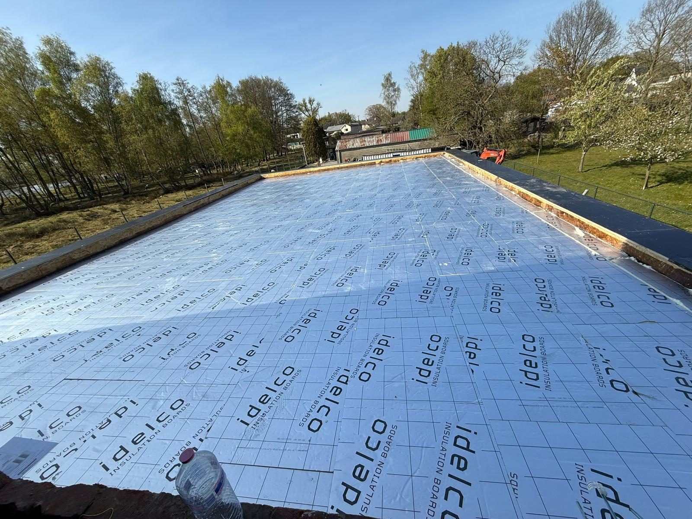
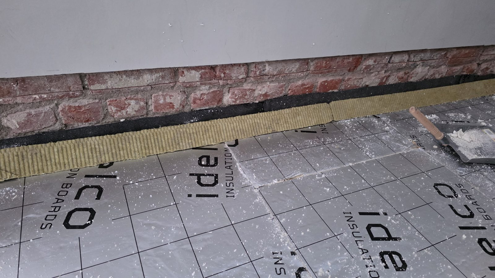
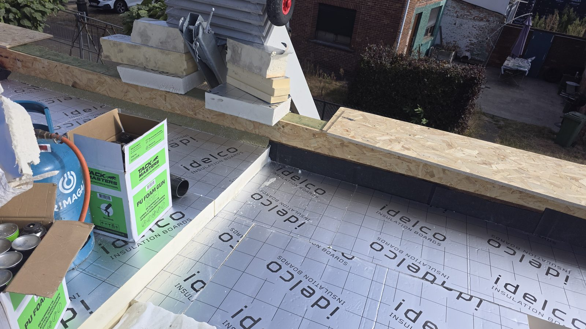
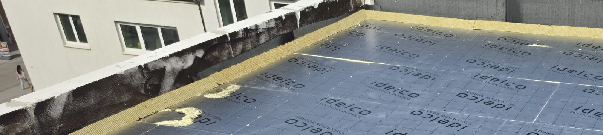
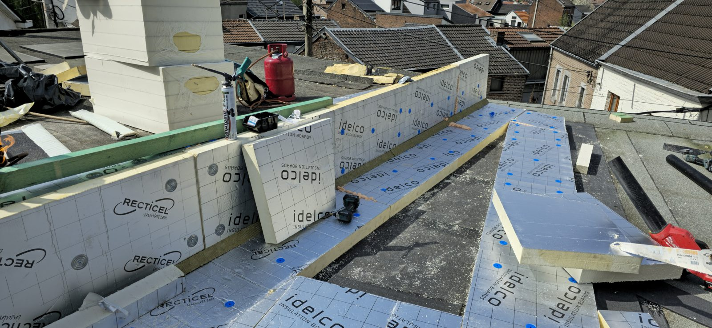
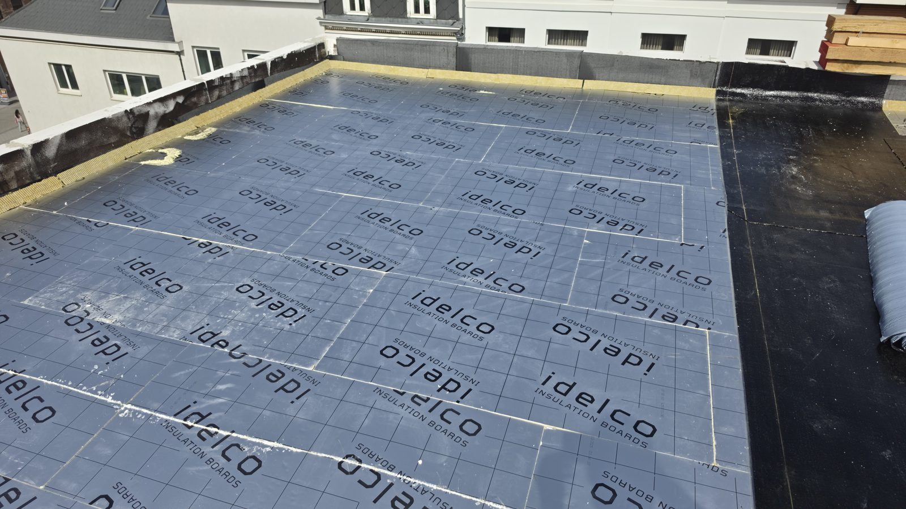

# LEKCJA 1.5 — IZOLACJA TERMICZNA (Thermische isolatie)

## Constructie en ondergrond — serce ciepłego dachu

-----

### 🎯 Po tej lekcji będziesz wiedział:

  - Jakie są rodzaje izolacji i czym się różnią (λ, Rd)
  - Jakie są normy: minimum, EPC A, EPC A+++ — i ile cm trzeba
  - Dlaczego PIR 12cm to pułapka — i czemu zaczynamy od 14cm
  - Jak unikać mostków termicznych (koudebruggen)
  - Dlaczego dookoła PIR dajemy pas wełny (43 wypchnięte ściany w Belgii!)
  - Co to rotswol driehoeken i czemu są genialne przy binnenhoek
  - Metody kładzenia: mechanisch, klejone, kiedy luzem
  - Obniżenie izolacji pod afloop
  - Najczęstsze błędy i ryzyka

-----

## 1. PO CO IZOLACJA I JAK SIĘ JĄ MIERZY

Izolacja to warstwa, która **zatrzymuje ciepło w budynku**. W ciepłym dachu (warmdak) leży **na dakvloer, na dampscherm** (patrz Lekcja 1.4), pod dakbedekking.

Dwie liczby które MUSISZ znać:

**λ (lambda) — przewodność cieplna** [W/mK]
  - Mówi ile ciepła ucieka przez materiał
  - **Im NIŻSZA λ, tym lepiej izoluje** (cieńsza warstwa wystarczy)
  - PIR ma najniższą λ z popularnych (≈0,022) — dlatego cienki a mocny

**Rd — opór cieplny** [m²K/W]
  - Mówi jak dobrze cała warstwa trzyma ciepło
  - **Im WYŻSZA Rd, tym lepiej**
  - Wzór: **Rd = grubość (m) ÷ λ**
  - Przykład: 12cm PIR λ=0,022 → 0,12 ÷ 0,022 = **Rd 5,45**

📐 To Rd jest tym, co liczą gminy, premie i EPC. Grubość w cm to tylko środek do celu — liczy się Rd.

-----

## 2. RODZAJE IZOLACJI

| Materiał | λ (W/mK) | Cechy |
| :-: | :-: | :-: |
| **PIR (płyty)** | 0,022–0,028 | Najlepszy λ, sztywny, drukvast, **standard na płaskim pod papę** |
| **PUR (płyty)** | 0,022–0,028 | Jak PIR, twarde płyty na płaski dach |
| **PUR natryskowy (gespoten)** | 0,023–0,028 | **NIE pod papę! Tylko skosy/poddasza/od wewnątrz** |
| **Rotswol** (wełna skalna) | 0,034–0,040 | Niepalna; **pod papę tylko PRASOWANA (drukvast)**; miękka do rogów/opstand |
| **Glaswol** (wełna szklana) | 0,032–0,040 | Tania, miękka, lekka — nie pod papę |
| **EPS** | 0,030–0,038 | Tani, lekki, ale rozpuszcza go primer olejowy! |
| **XPS** | 0,029–0,036 | Wodoodporny, do omkeerdak (odwróconego) |

🔑 **Tip Mariusza — na płaski dach pod papę:**
- **Standard to PIR w płytach** — najlepszy λ, sztywny, drukvast, można po nim chodzić. Bywają też płyty PIR powlekane bitumem (idą prosto pod roofing).
- **PUR natryskowy (gespoten) to CO INNEGO** — to się natryskuje na **skosy (gordingendak), zoldervloer, od wewnątrz** poddasza. **NIE daje się go na płaski dach pod papę od zewnątrz** — tam idą twarde płyty PIR. Natryskowy na płaskim to nisza (czasem między dwiema warstwami roofingu), nie standard.
- **Wełna pod papę — tylko PRASOWANA (drukvast, ~45 kg/m³).** Miękka wełna do skosów się zgniecie pod warstwą wierzchnią i pod chodzeniem. Pod papę musi być twarda prasowana płyta.
- **Wełna nie odbija promieni słonecznych** — PIR ma srebrną/aluminiową okładzinę (jak Eurothane Silver), która odbija promieniowanie. Goła wełna tego nie ma, więc gorzej radzi sobie z nagrzewaniem od słońca.
- Glaswol idzie głównie na akustykę/skosy. EPS uważaj — primer olejowy go zżera (patrz Lekcja 1.2).

-----

## 3. NORMY — ILE TRZEBA (TO KLUCZ)

Uwaga — trzeba rozdzielić **dwie różne rzeczy**, które ludzie mylą:

### 📐 Rd — norma IZOLACJI (to liczymy my, dekarze)

To opór cieplny samej warstwy izolacji. To jest to, co masz dostarczyć na dachu:

| Poziom | Norma Rd | Co to znaczy |
| :-: | :-: | :-: |
| Woningkwaliteit (absolutne minimum) | Rd 0,75 | tylko żeby dom nie był "ongeschikt" — w praktyce nikt tak nie buduje |
| **Premie (Mijn VerbouwPremie)** | **Rd ≥ 4,5** | **od tego progu zaczynają się dotacje** |
| **Realny standard mieszkaniówka** | **Rd 5,45+** | Twój standard, bezpieczny |
| Nowa budowa / IER | praktyka 18–22 cm | U-waarde ≤ 0,15, Rd grubo ponad 6 |

🔑 **Tip Mariusza — jak to jest naprawdę:**
- **Rd 0,75** to wettelijk minimum woningkwaliteit — ale tak nisko nikt nie buduje, to tylko próg "żeby dom nie był uznany za niezdatny".
- **Premie (Mijn VerbouwPremie) zaczyna się od Rd 4,5** — poniżej tego klient nie dostanie ani grosza dotacji. To jest ważne przy ofercie: jak dajesz mniej niż 4,5, klient traci premię.
- **Realnie na domu mieszkalnym nie schodzi się poniżej Rd 5,45.** To bezpieczny standard.
- **Normy Rd ustala region (EPB/Vlaanderen), nie gmina.** Ale **gmina przy vergunning sprawdza inne rzeczy** na dachu: groendak (dach zielony obowiązkowy?), jasny kolor papy, hemelwater, max grubość izolacji zewnętrznej (np. Antwerpen max 26cm). Zawsze sprawdź lokalny bouwcode danej gminy przed ofertą — bo to potrafi wywrócić projekt.

### 💰 Ile to oszczędza?

Dobrze zaizolowany dach to nie tylko norma — to realne pieniądze dla klienta:

- Przez słabo zaizolowany dach ucieka **25–30% ciepła** budynku
- Dobra izolacja dachu = oszczędność rzędu **€400–700 rocznie** na ogrzewaniu (typowy dom)
- Inwestycja zwraca się w **4–10 lat**, a izolacja działa dekady

🔑 **Tip Mariusza:** to argument sprzedażowy, nie tylko techniczny. Klientowi mów liczbami: "te kilka cm więcej PIR to ~€500 rocznie mniej na gazie i zwrot w parę lat". Grubsza izolacja kosztuje parę euro/m² więcej, a oszczędza latami. Plus lepszy EPC = wyższa wartość domu przy sprzedaży.

> 🪟 **Okna dachowe (dakramen/koepels) mają osobne minimum.** Przy nowej budowie / IER okno dachowe też musi spełnić swoją U-waarde (przegląd przeszklenia), tak samo jak dach swoją Rd. Czyli sam dobry dach nie wystarczy — okno z kiepską szybą psuje bilans. Pamiętaj o tym przy projekcie z koepelami/lichtkoepels.

### 🏠 EPC — wynik CAŁEGO domu (osobna sprawa, nie nasza działka)

EPC to **nie** grubość izolacji. To wynik energetyczny całego budynku w **kWh/m²/rok** — liczy izolację + ogrzewanie + wentylację + okna + panele razem. Robi to energiedeskundige, nie dekarz.

Skala EPC w Vlaanderen:

| Label | kWh/m²/rok |
| :-: | :-: |
| **A+** | ≤ 0 (dom produkuje tyle ile zużywa) |
| **A** | 0–100 |
| **B** | 100–200 |
| **C** | 200–300 |
| **D** | 300–400 |
| **E** | 400–500 |
| **F** | > 500 |

⚠️ **Ważne:** nie da się powiedzieć "16cm PIR = label A" — bo EPC zależy od całego domu (ogrzewanie, panele, okna), nie od samej izolacji dachu. Grubsza izolacja **pomaga** do lepszego EPC, ale to tylko jeden składnik. Nasza robota to dowieźć **Rd** (min. 5,45) i dać klientowi fakturę z Rd materiału — resztę EPC liczy energiedeskundige.

> 📌 Dla nowego budownictwa nie używa się już EPC label A/B, tylko E-peil (max E30) i S-peil (max S28) + min. 15 kWh/m² energii odnawialnej. Ale to działka architekta/EPB, nie dekarza.

### ⚠️ Pułapka PIR 12cm

Teoria mówi: 12cm PIR = Rd 5,45. **Ale to działa tylko przy λ=0,022!** Nie każdy producent ma tak dobry λ:

  - λ=0,022 → 12cm = Rd 5,45 ✅
  - λ=0,025 → 12cm = Rd 4,8 ⚠️
  - λ=0,028 → 12cm = Rd 4,3 ❌ (poniżej normy!)

**Dlatego najbezpieczniej zaczynać od 14cm.** Wtedy nawet słabszy producent łapie 5,45 z zapasem. Nie polegaj na "12cm zawsze wystarczy" — **sprawdź λ na technische fiche producenta** i przelicz Rd.

### 📦 Dwie warstwy zamiast jednej (14cm = 2×7 lub 8+6)

Zamiast jednej płyty 14cm, kładziemy **dwie warstwy** — np. 2×7cm albo 8+6cm:

  - Druga warstwa **zakrywa łączenia (spoiny) spodniej warstwy**
  - Przesunięte spoiny = **brak mostków termicznych przez fugi**
  - Pojedyncza gruba płyta ma fugi na wylot — ciepło ucieka szczeliną

🔑 **Tip Mariusza:** zawsze dwie warstwy z przesuniętymi łączeniami. Jedna gruba płyta = każda fuga to mostek na wylot. Dwie warstwy = górna zakrywa fugi dolnej, ciepło nie ma którędy uciec.

-----

## 4. MOSTKI TERMICZNE (Koudebruggen) — JAK ICH UNIKAĆ

Mostek termiczny to miejsce gdzie ciepło ucieka szybciej niż dookoła — bo izolacja jest przerwana, cieńsza albo źle ułożona. Skutek: zimne plamy, kondensacja, pleśń.

Jak unikać:
  - **Dwie warstwy PIR z przesuniętymi spoinami** (patrz wyżej)
  - **Ciągłość izolacji** — żadnych przerw, szczelin, dziur
  - **Izolacja dochodzi wszędzie** — pod dakrand, do opstandów, wokół przejść
  - **Pas wełny + driehoeken przy ścianach** (sekcje 5 i 6)

-----

## 5. PAS WEŁNY 5CM DOOKOŁA — NOWY PRZEPIS (43 wypchnięte ściany!)

To jest świeży przepis i KAŻDY dekarz musi go znać.

**Co się stało:** PIR na powierzchni dachu pod wpływem wilgoci **pęcznieje i rozszerza się**. Ten napór jest tak duży, że **wypchnął 43 ściany w Belgii** — głównie nowe budownictwo, ścianki opstand z pustaka 12cm po prostu nie wytrzymały i popękały (rysy na elewacji crepi/ETICS).

Buildwise to udokumentował (artykuł 2022/02.04): płyty PU/PIR pod wpływem zawilgocenia rozszerzają się i wypychają dakopstandy na zewnątrz — patologia powodująca pęknięcia w murze i tynku.

**Rozwiązanie — pas wełny:**
  - Dookoła dachu, przy każdej ścianie/opstandzie: **5cm wełny (rotswol)**
  - Szeroki na 5cm, **wysoki na wysokość izolacji PIR**
  - Wełna jest miękka i ściśliwa → **amortyzuje napór pęczniejącego PIR**
  - Ściana nie dostaje całej siły, nie pęka

🔑 **Tip Mariusza — pełny mechanizm czemu ściany pękają:** to nie jest jedna przyczyna, tylko kilka na raz:

1. **Za mało izolacji na opstandzie z Ytong** — ludzie myślą "Ytong sam jest izolatorem, wystarczy cienko". Nieprawda: dają za mało, **ściana przemarza**.
2. **Brak PU-lijm między izolacją a ścianą** — izolacja nie jest przyklejona do muru, jest luz, izolacja pracuje/odchodzi.
3. **Brak driehoeken w rogu** — robi się **mostek termiczny**, róg przemarza.
4. **Napór pęczniejącego PIR** — PIR od wilgoci się rozszerza (Buildwise 2022/02.04).

Wszystko razem: ściana **przemarza + pęcznieje + dostaje napór** = pęka. Crepi/ETICS rysuje się, pustak 12cm nie wytrzymuje. Dlatego rozwiązanie to nie jedna rzecz, tylko **komplet: 5cm wełny + PU-lijm izolacji do muru + driehoeken w rogach + porządna izolacja opstandu**. Pominiesz jedno — i tak pęknie.

-----

## 6. ROTSWOL DRIEHOEKEN PRZY BINNENHOEK — INNA BAJKA
Uwaga: to **co innego niż pas 5cm.** Pas chroni mur przed naporem PIR. Driehoeken (trójkąty z wełny) robią coś zupełnie innego — i są genialne.

**Gdzie:** w binnenhoek — wewnętrzny kąt 90° między płaszczyzną dachu a opstandem (przy ścianie, koepel, każdym pionowym elemencie).

**Co robią — trzy rzeczy:**

1. **Minimalizują mostek termiczny** przy ścianie + docieplają róg
2. **Zamieniają kąt 90° → 45°** — z ostrego wewnętrznego kąta robi się łagodne skośne przejście
3. **GŁÓWNA ZALETA — współpraca z papą:** kładzione **luźno** (ruchome!), doskonale pracują z papą w binnenhoek:
   - Nie odciągają papy, nie odrywają, nie marszczą
   - Brak fałd, brak rozerwań na łączeniach
   - Budynek pracuje → trójkąt się rusza razem z nim → **papa wraca na swoje miejsce**

🔑 **Tip Mariusza:** sztywny kąt 90° to wróg papy — przy każdym ruchu budynku papa się napina, marszczy, w końcu pęka na zgięciu. Driehoek luźno włożony w róg robi z 90° łagodne 45° i — bo jest ruchomy — pracuje z budynkiem. Papa się nie napina, nie rwie, wraca na miejsce. Ten sam patent co rotswolhoeken z Lekcji 1.1: nie zgrzewamy na sztywno pod 90°, dajemy luźno żeby budynek mógł pracować.

> 📐 Buildwise podaje dla takich połączeń: rotswol gęstość ~45 kg/m³, na wysokość min. 15 cm przy opstandzie.

-----

## 6B. BRANDMUUR — IZOLUJEMY Z OBU STRON I OD GÓRY

Brandmuur (ściana ogniowa) to mur który wystaje ponad dach, zwykle na granicy z sąsiadem. Jest odsłonięty z każdej strony — i dlatego to **gruby mostek termiczny**, jeśli go nie zaizolujesz.

**Zasada: brandmuur izolujemy z OBU stron i OD GÓRY:**
  - **Obie strony** — mur dzieli dwa dachy/obszary, z każdej strony przylega izolacja, więc z każdej trzeba dociągnąć
  - **Od góry** — wierzch muru też izolowany i obrobiony, inaczej zimno wchodzi górą
  - Inaczej: cały mur przemarza, robi mostek na wylot, kondensacja przy ścianie z obu stron

🔑 **Tip Mariusza:** brandmuur to mostek jak się patrzy — odsłonięty mur sterczący nad dachem. Izolujesz go z obu stron i od góry, tak samo starannie jak opstand. Pominiesz jedną stronę albo wierzch — i masz zimną ścianę, kondensację i ślad przemarzania dokładnie wzdłuż brandmuur.

-----

## 7. METODY KŁADZENIA IZOLACJI

Trzy sposoby — wybierasz wg podłoża i windweerstand:

### 🔩 Mechanische bevestiging (mocowanie mechaniczne)
  - Płyty przykręcane do podłoża śrubami z talerzykami (drukschotels)
  - Standard na staaldek i tam gdzie trzeba mocnego trzymania (wiatr)
  - Pewne, niezależne od pogody

### 🧴 Klejona (verlijmd / gekleefd)
  - Płyty klejone na koudlijm albo na zgrzewany dampscherm
  - Czysto, szybko, bez przebijania dampscherm śrubami
  - Standard przy ciągłej warstwie na betonie/OSB

### 🆓 Luzem (los gelegd) — kiedy MOŻNA
  - Płyty układane luźno, dociążone od góry (np. ballast, grind, dakbedekking mechanicznie mocowana wyżej)
  - Tylko gdy warstwa wierzchnia trzyma wszystko razem
  - Szybkie, ale wymaga dociążenia/mocowania na górze

🔑 **Tip Mariusza:** klejona = czysto i bez dziur w dampscherm. Mechaniczna = gdy wiatr albo staaldek. Luzem = tylko jak masz ballast albo mocowanie wierzchnie. Nigdy luzem "bo szybciej" jak nic nie trzyma od góry.

> ⚠️ **PU-lijm do ściany:** izolację przy opstandach/murach **przyklej PU-lijmem do muru** — nie zostawiaj luzem przy ścianie. Bez kleju izolacja odchodzi od muru, robi się luz i szczelina (mostek), a to jedna z przyczyn pękania ścian (patrz sekcja 5).

-----

## 8. OBNIŻENIE IZOLACJI POD AFLOOP

Ważny detal: **już w warstwie izolacji obniżamy ją pod afloop** (odpływ).

  - W miejscu odpływu izolacja jest **cieńsza / wybrana** — robi się lokalne zagłębienie
  - Woda spływa do najniższego punktu = do afloop
  - Jeśli izolacja jest równa wszędzie, woda stoi wokół odpływu zamiast do niego wpadać

To się robi **już na etapie izolacji**, nie dopiero papą. Papa idzie za kształtem izolacji — jak izolacja jest płaska przy odpływie, papa też i woda stoi.

🔑 **Tip Mariusza:** afloop to najniższy punkt dachu — izolacja musi go "zaprosić". Obniżasz izolację lejkowato wokół odpływu już teraz, papa pójdzie za tym kształtem i woda sama spłynie. Płaska izolacja przy afloop = kałuża i z czasem przeciek.

-----

## 9. NAJCZĘSTSZE BŁĘDY I RYZYKA

| Błąd | Skutek |
| :-: | :-: |
| Jedna gruba płyta zamiast 2 warstw | Mostki przez fugi na wylot |
| Spoiny obu warstw w tym samym miejscu | Mostek termiczny |
| PIR 12cm bez sprawdzenia λ | Może nie łapać Rd 5,45 |
| Brak pasa 5cm wełny przy ścianie | PIR wypycha i pęka mur |
| Brak PU-lijm izolacji do muru | Luz przy ścianie, mostek, ściana pęka |
| Za mało izolacji na opstandzie Ytong | Ściana przemarza, pęka |
| Sztywny kąt 90° bez driehoek | Papa marszczy się i pęka w binnenhoek |
| Brandmuur izolowany tylko z jednej strony | Mur przemarza, mostek, kondensacja wzdłuż ściany |
| Izolacja równa pod afloop | Woda stoi, nie spływa do odpływu |
| Przerwy/szczeliny w izolacji | Mostki termiczne, zimne plamy, pleśń |
| EPS + primer olejowy | Primer rozpuszcza EPS |
| PUR natryskowy na płaski dach pod papę | Zła robota — pod papę idą płyty PIR, nie natryskowy |
| Miękka (nieprasowana) wełna pod papę | Zgniecie się pod chodzeniem i warstwą wierzchnią |
| Luzem bez dociążenia | Wiatr podrywa, izolacja się rusza |

-----

## ✅ PODSUMOWANIE

  - Izolacja = serce ciepłego dachu; liczą się **λ** (im niżej tym lepiej) i **Rd** (im wyżej tym lepiej)
  - **Pod papę = płyty PIR/PUR** (twarde, drukvast); **wełna tylko prasowana**; **PUR natryskowy NIE pod papę** (to na skosy/poddasza); wełna nie odbija promieni jak PIR (srebrna okładzina)
  - **Rd to nasza norma:** minimum realne = **Rd 5,45** (gminy, nie premie 4,5!). **EPC to osobna sprawa** — wynik całego domu w kWh/m² (A+ do F), liczy go energiedeskundige
  - PIR 12cm to pułapka — zależy od λ producenta; **bezpiecznie od 14cm (2×7 lub 8+6)**, dwie warstwy z przesuniętymi spoinami
  - **Ściany pękają z kilku przyczyn na raz:** za mało izolacji na Ytong (przemarza) + brak PU-lijm + brak driehoeken (mostek) + napór pęczniejącego PIR. Rozwiązanie = komplet: **5cm wełny + PU-lijm do muru + driehoeken + porządna izolacja opstandu**
  - **Rotswol driehoeken** w binnenhoek = 90°→45°, ruchome, współpraca z papą (nie marszczy, nie rwie, wraca na miejsce)
  - **Brandmuur** izolujemy z obu stron i od góry (odsłonięty mur = mostek termiczny)
  - Metody: mechanisch / klejona / luzem (tylko z dociążeniem); izolację przy murze **klej PU-lijmem**
  - **Obniżenie izolacji pod afloop** już na etapie izolacji — woda sama spłynie

-----

## 📝 QUIZ — Lekcja 1.5 (próg zaliczenia 70%)

**1. Co idzie na płaski dach pod papę?**
- A) PUR natryskowy (gespoten)
- B) Twarde płyty PIR/PUR (drukvast); wełna tylko prasowana
- C) Miękka wełna do skosów
- D) Glaswol w rolkach

**Poprawna: B**

**2. Jak liczymy Rd?**
- A) Rd = λ × grubość
- B) Rd = grubość (m) ÷ λ
- C) Rd = λ ÷ grubość
- D) Rd = grubość × 2

**Poprawna: B**

**3. Od jakiego Rd zaczyna się premie (Mijn VerbouwPremie)?**
- A) Od Rd 0,75
- B) Od Rd 4,5 — poniżej tego klient nie dostanie dotacji
- C) Od Rd 2,0
- D) Premia nie zależy od Rd

**Poprawna: B**

**4. Dlaczego PIR 12cm to pułapka?**
- A) Bo jest za drogi
- B) Bo Rd 5,45 wychodzi tylko przy λ=0,022; gorszy producent (λ wyższe) nie łapie normy
- C) Bo 12cm to za grubo
- D) Bo PIR się pali

**Poprawna: B**

**5. Czemu kładziemy dwie warstwy izolacji zamiast jednej grubej?**
- A) Bo tak ładniej wygląda
- B) Bo druga warstwa zakrywa spoiny pierwszej — brak mostków przez fugi
- C) Bo jedna płyta jest za ciężka
- D) Nie ma różnicy

**Poprawna: B**

**6. Po co pas 5cm wełny dookoła dachu przy ścianach?**
- A) Dla ocieplenia akustycznego
- B) Bo PIR pęcznieje i wypycha mur — wełna amortyzuje napór (43 wypchnięte ściany)
- C) Żeby papa lepiej się kleiła
- D) To tylko ozdoba

**Poprawna: B**

**7. Jaka jest GŁÓWNA zaleta rotswol driehoeken w binnenhoek?**
- A) Są tanie
- B) Kładzione luźno, robią z kąta 90° łagodne 45° i ruchomo współpracują z papą — nie marszczy się, nie pęka, wraca na miejsce
- C) Są niepalne
- D) Dają kolor

**Poprawna: B**

**8. Która metoda kładzenia izolacji jest bez przebijania dampscherm śrubami?**
- A) Mechaniczna
- B) Klejona (verlijmd)
- C) Luzem bez niczego
- D) Żadna

**Poprawna: B**

**9. Kiedy można kłaść izolację luzem (los)?**
- A) Zawsze, bo najszybciej
- B) Tylko gdy warstwa wierzchnia / ballast trzyma wszystko razem
- C) Nigdy
- D) Tylko zimą

**Poprawna: B**

**10. Co robimy z izolacją pod afloop?**
- A) Kładziemy ją grubiej
- B) Obniżamy ją (lejkowato) już na etapie izolacji, żeby woda spłynęła do odpływu
- C) Zostawiamy równo
- D) Pomijamy izolację tam

**Poprawna: B**

**11. Co to jest mostek termiczny (koudebrug)?**
- A) Element konstrukcji nośnej
- B) Miejsce gdzie ciepło ucieka szybciej (przerwana/cieńsza izolacja) — zimne plamy, kondensacja
- C) Rodzaj papy
- D) Narzędzie dekarza

**Poprawna: B**

**12. Czym różni się Rd od EPC?**
- A) To to samo
- B) Rd = norma izolacji (cm/λ, min. 5,45), EPC = wynik całego domu w kWh/m² (izolacja + ogrzewanie + okna + panele)
- C) Rd liczy energiedeskundige, EPC dekarz
- D) EPC mierzy się w cm

**Poprawna: B**
